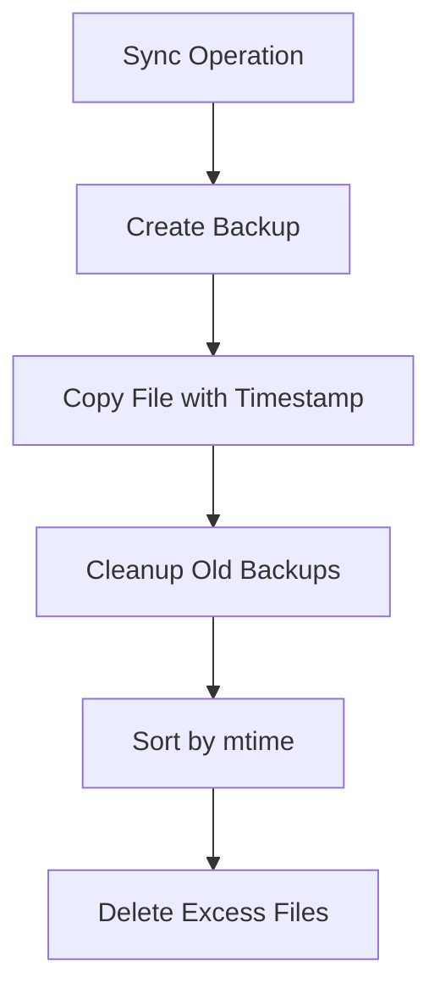
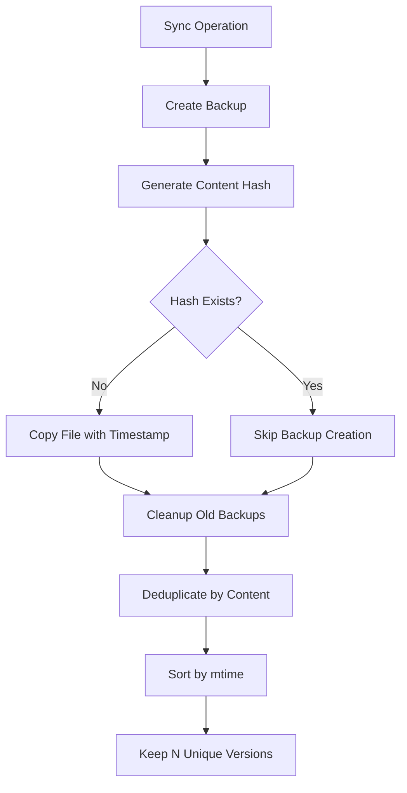

# Design: Backup Retention Deduplication

## Overview

Implement content-based deduplication for backup retention to prevent storing multiple copies of identical file content. Users will get meaningful, distinct versions for rollback instead of duplicate backups.

---

## System Architecture

### Current Architecture


### New Architecture with Deduplication


---

## Technical Design

### 1. Content Hash Generation

**Location:** `src/utils/backupUtils.ts` (new file)

```typescript
import { createHash } from 'node:crypto';
import { safeReadFile } from './safeFs';

interface BackupInfo {
  path: string;
  hash: string;
  mtime: number;
  name: string;
}

export function generateContentHash(filePath: string): string | null {
  const readResult = safeReadFile(filePath);
  if (!readResult.success) {
    return null;
  }
  
  return createHash('sha256')
    .update(readResult.data)
    .digest('hex');
}
```

### 2. Duplicate Detection

```typescript
export function findDuplicateBackups(backups: BackupInfo[]): Map<string, BackupInfo[]> {
  const hashGroups = new Map<string, BackupInfo[]>();
  
  for (const backup of backups) {
    const existing = hashGroups.get(backup.hash) || [];
    existing.push(backup);
    hashGroups.set(backup.hash, existing);
  }
  
  return hashGroups;
}
```

### 3. Deduplication Logic

```typescript
export function deduplicateBackups(backups: BackupInfo[]): BackupInfo[] {
  const hashGroups = findDuplicateBackups(backups);
  const uniqueBackups: BackupInfo[] = [];
  
  for (const [hash, duplicates] of hashGroups) {
    // Keep the most recent backup for each unique content
    const newest = duplicates.sort((a, b) => b.mtime - a.mtime)[0];
    uniqueBackups.push(newest);
  }
  
  return uniqueBackups.sort((a, b) => b.mtime - a.mtime);
}
```

### 4. Enhanced Cleanup Function

**Location:** `src/secrets-sync.ts` (modify existing)

```typescript
import { generateContentHash, deduplicateBackups, BackupInfo } from './utils/backupUtils';

function cleanupOldBackups(bakDir: string, fileName: string, keepCount: number) {
  const readResult = safeReadDir(bakDir);
  if (!readResult.success) {
    logWarn(`Failed to cleanup old backups: ${readResult.error.error.message}`);
    return;
  }
  
  try {
    const pattern = `${fileName}-`;
    const backupFiles = readResult.data
      .filter(f => f.startsWith(pattern) && f.endsWith('.bak'));
    
    // Generate hashes for all backups
    const backups: BackupInfo[] = [];
    for (const file of backupFiles) {
      const path = join(bakDir, file);
      const stat = statSync(path);
      const hash = generateContentHash(path);
      
      if (hash) {
        backups.push({
          path,
          hash,
          mtime: stat.mtimeMs,
          name: file
        });
      }
    }
    
    // Deduplicate and keep only N unique versions
    const uniqueBackups = deduplicateBackups(backups);
    const toKeep = uniqueBackups.slice(0, keepCount);
    const toDelete = backups.filter(b => !toKeep.some(k => k.path === b.path));
    
    // Delete excess and duplicate backups
    for (const backup of toDelete) {
      spawnSync('rm', [backup.path]);
      logDebug(`Deleted backup: ${backup.name}`);
    }
    
    logDebug(`Kept ${toKeep.length} unique backups out of ${backups.length} total`);
    
  } catch (e) {
    logWarn(`Backup cleanup failed: ${(e as Error).message}`);
  }
}
```

### 5. Smart Backup Creation

**Location:** `src/secrets-sync.ts` (modify existing backup creation)

```typescript
function createBackupIfNeeded(sourcePath: string, bakDir: string, fileName: string): boolean {
  // Check if we should skip backup creation
  const newContentHash = generateContentHash(sourcePath);
  if (!newContentHash) {
    // Can't hash, create backup anyway (safe default)
    createBackup(sourcePath, bakDir, fileName);
    return true;
  }
  
  // Check most recent backup
  const readResult = safeReadDir(bakDir);
  if (readResult.success) {
    const pattern = `${fileName}-`;
    const recentBackups = readResult.data
      .filter(f => f.startsWith(pattern) && f.endsWith('.bak'))
      .map(f => ({ name: f, path: join(bakDir, f), stat: statSync(join(bakDir, f)) }))
      .sort((a, b) => b.stat.mtimeMs - a.stat.mtimeMs)
      .slice(0, 1); // Just check the most recent
    
    if (recentBackups.length > 0) {
      const recentHash = generateContentHash(recentBackups[0].path);
      if (recentHash === newContentHash) {
        logDebug(`Skipping backup creation - content unchanged: ${fileName}`);
        return false;
      }
    }
  }
  
  // Content is different or no recent backup exists
  createBackup(sourcePath, bakDir, fileName);
  return true;
}
```

---

## Implementation Approach

### Phase 1: Core Deduplication (P0)
1. Create `backupUtils.ts` with hash generation and deduplication logic
2. Modify `cleanupOldBackups()` to use content-based deduplication
3. Add unit tests for hash generation and duplicate detection

### Phase 2: Smart Backup Creation (P1)
1. Implement `createBackupIfNeeded()` to skip duplicate content
2. Integrate with existing backup creation points
3. Add integration tests for backup skipping

### Phase 3: Performance Optimization (P2)
1. Add hash caching for recently processed files
2. Optimize for large files (streaming hash generation)
3. Add performance monitoring and logging

---

## Data Structures

### BackupInfo Interface
```typescript
interface BackupInfo {
  path: string;        // Full path to backup file
  hash: string;        // SHA-256 content hash
  mtime: number;       // Modification time (mtimeMs)
  name: string;        // Filename only
}
```

### Hash Cache (Future Enhancement)
```typescript
interface HashCache {
  [filePath: string]: {
    hash: string;
    mtime: number;
    size: number;
  };
}
```

---

## Error Handling

### File Read Errors
- If content hash generation fails, create backup anyway (safe default)
- Log warning but don't fail the entire operation
- Gracefully handle permission errors

### Hash Collision (Extremely Rare)
- SHA-256 collision probability is negligible for this use case
- If detected, keep both files (safer than deletion)
- Log warning for investigation

### Performance Degradation
- If hashing takes >100ms, log performance warning
- Consider file size limits for hash generation
- Fallback to timestamp-based cleanup if needed

---

## Testing Strategy

### Unit Tests
```typescript
describe('backupUtils', () => {
  test('generateContentHash returns consistent hash for same content');
  test('generateContentHash returns different hash for different content');
  test('findDuplicateBackups groups by hash correctly');
  test('deduplicateBackups keeps newest of each unique content');
  test('handles file read errors gracefully');
});
```

### Integration Tests
```typescript
describe('backup deduplication', () => {
  test('cleanup removes duplicate backups');
  test('cleanup preserves N unique versions');
  test('smart backup creation skips duplicates');
  test('works with multiple env files independently');
  test('handles existing backup directory with duplicates');
});
```

### Performance Tests
```typescript
describe('performance', () => {
  test('hash generation completes within 50ms for typical files');
  test('deduplication completes within 100ms for 10 backups');
  test('memory usage remains stable during processing');
});
```

---

## Configuration

### Existing Configuration (No Changes)
```yaml
# env-config.yml
flags:
  backupRetention: 3  # Keep 3 unique versions
```

### Future Configuration Options
```yaml
# env-config.yml (potential future enhancements)
backup:
  retention: 3
  deduplication: true        # Enable/disable deduplication
  maxFileSizeForHashing: 10  # MB limit for hash generation
  hashCacheEnabled: true     # Enable hash caching
```

---

## Migration Strategy

### Backward Compatibility
- Existing backups work without modification
- No changes to backup file naming or structure
- Gradual cleanup of existing duplicates during normal operation

### Rollout Plan
1. **Phase 1:** Deploy deduplication logic (cleanup only)
2. **Phase 2:** Enable smart backup creation (skip duplicates)
3. **Phase 3:** Add performance optimizations

### Rollback Plan
- Feature can be disabled by reverting to original `cleanupOldBackups()`
- No data loss - worst case is keeping more backups than needed
- Existing backups remain intact and functional

---

## Performance Considerations

### Hash Generation
- SHA-256 is fast for typical .env files (<1KB)
- For larger files, consider streaming or size limits
- Cache hashes to avoid recomputation

### File I/O
- Minimize file reads during cleanup
- Batch file operations where possible
- Use existing `safeFs` utilities for error handling

### Memory Usage
- Process backups in batches for large directories
- Don't load all file contents into memory simultaneously
- Clean up temporary data structures

---

## Security Considerations

### Hash Algorithm
- SHA-256 provides sufficient collision resistance
- No cryptographic security needed (not for authentication)
- Fast computation with good distribution

### File Access
- Use existing `safeFs` utilities for permission handling
- Graceful degradation when files are unreadable
- No exposure of file contents in logs or errors

---

## Monitoring and Logging

### Debug Logging
```typescript
logDebug(`Generated hash for ${fileName}: ${hash.substring(0, 8)}...`);
logDebug(`Found ${duplicates.length} duplicates for content hash`);
logDebug(`Skipping backup creation - content unchanged: ${fileName}`);
logDebug(`Kept ${kept} unique backups out of ${total} total`);
```

### Performance Logging
```typescript
logDebug(`Hash generation took ${duration}ms for ${fileName}`);
logDebug(`Deduplication processed ${count} backups in ${duration}ms`);
```

### Error Logging
```typescript
logWarn(`Failed to generate hash for ${fileName}: ${error.message}`);
logWarn(`Backup cleanup failed: ${error.message}`);
```

---

## Success Metrics

### Functional Metrics
- Zero duplicate backups with identical content
- Retention count matches unique versions (up to configured limit)
- 100% data integrity during deduplication

### Performance Metrics
- Hash generation: <50ms for typical .env files
- Deduplication: <100ms for 10 backup files
- Memory usage: <10MB additional during cleanup

### User Experience Metrics
- Meaningful rollback options (distinct versions)
- Reduced storage usage (no duplicate content)
- No performance degradation during sync operations
