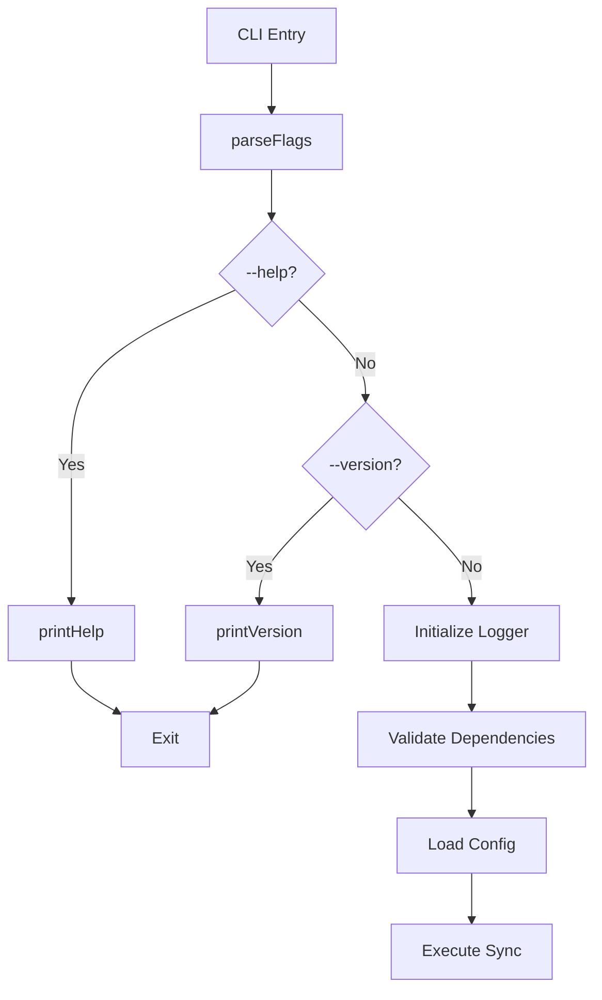
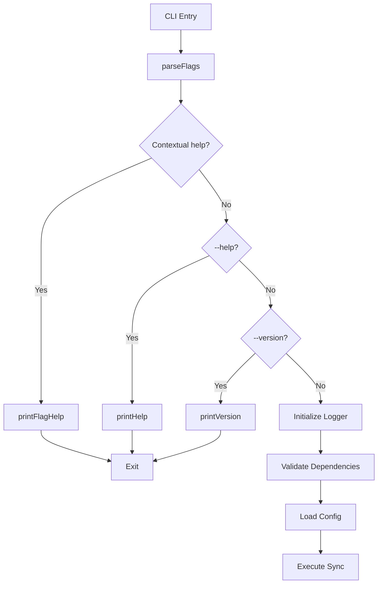

# Design: Contextual Help System

## Overview

Implement flag-specific help using the pattern `secrets-sync <flag> --help` to provide detailed documentation without leaving the terminal. This design builds on the existing `parseFlags()` and `printHelp()` functions in `src/secrets-sync.ts`.

**End-user benefit:** Users get instant, detailed help for specific flags without reading full documentation or leaving the terminal, reducing onboarding friction and improving discoverability.

---

## System Architecture

### Current Architecture



### New Architecture with Contextual Help



**Key change:** Contextual help detection happens first, before any other processing, ensuring no unnecessary logging or file operations.

---

## Technical Design

### 1. Flag Help Data Structure

**Location:** `src/help/flagHelp.ts` (new file)

```typescript
interface FlagHelp {
  flag: string;
  aliases?: string[];
  description: string;
  usage: string[];
  whenToUse: string[];
  whenNotToUse?: string[];
  relatedFlags?: string[];
  docsUrl: string;
}

const FLAG_HELP: Record<string, FlagHelp> = {
  '--env': {
    flag: '--env',
    description: 'Target a specific environment for sync operations.',
    usage: [
      'secrets-sync --env staging',
      'secrets-sync --env production --dry-run',
    ],
    whenToUse: [
      'Sync only one environment instead of all',
      'Test changes in staging before production',
    ],
    relatedFlags: ['--dry-run', '--overwrite'],
    docsUrl: 'https://github.com/Dorsey-Creative/secrets-sync-cli#env',
  },
  '--force': {
    flag: '--force',
    aliases: ['-f'],
    description: 'Use prefixes for production files instead of layering.',
    usage: [
      'secrets-sync --force --dry-run',
      'secrets-sync --force --env production',
    ],
    whenToUse: [
      'You want explicit prefixes for production overrides',
      'You need to distinguish between .env and .env.prod secrets',
    ],
    whenNotToUse: [
      'You want layered overrides (default behavior)',
    ],
    relatedFlags: ['--overwrite', '--dry-run'],
    docsUrl: 'https://github.com/Dorsey-Creative/secrets-sync-cli#force',
  },
  // ... other flags
};
```

**Design decision:** Inline object for simplicity. Can migrate to JSON if content grows beyond ~500 lines.

**End-user benefit:** Consistent, structured help content ensures users always get complete information.

---

### 2. Contextual Help Detection

**Location:** `src/secrets-sync.ts` (modify existing `parseFlags()`)

```typescript
function parseFlags(argv: string[]): Flags | { contextualHelp: string } {
  // Check for contextual help pattern first
  for (let i = 0; i < argv.length - 1; i++) {
    const arg = argv[i];
    const next = argv[i + 1];

    if ((next === '--help' || next === '-h') && arg.startsWith('--')) {
      return { contextualHelp: arg };
    }
  }

  // Existing flag parsing logic...
  const flags: Flags = { /* ... */ };
  // ...
  return flags;
}
```

**Design decision:** Early detection before any flag processing ensures we exit before logging or config loading.

**End-user benefit:** No confusing warnings or errors when requesting help.

---

### 3. Help Renderer

**Location:** `src/help/renderer.ts` (new file)

```typescript
import { FLAG_HELP } from './flagHelp';
import { printHelp } from '../secrets-sync';

export function printFlagHelp(flagName: string): void {
  const help = FLAG_HELP[flagName];

  if (!help) {
    // Fallback to full help screen (safe default)
    console.log(`\nNo detailed help available for ${flagName} yet.\n`);
    printHelp();
    return;
  }

  console.log(`\n🔐 Help: ${help.flag}${help.aliases ? `, ${help.aliases.join(', ')}` : ''}\n`);
  console.log(help.description);
  console.log('\nUsage:');
  help.usage.forEach(u => console.log(`  ${u}`));

  console.log('\nWhen to use:');
  help.whenToUse.forEach(w => console.log(`  ✓ ${w}`));

  if (help.whenNotToUse?.length) {
    console.log('\nWhen NOT to use:');
    help.whenNotToUse.forEach(w => console.log(`  ✗ ${w}`));
  }

  if (help.relatedFlags?.length) {
    console.log('\nRelated flags:');
    help.relatedFlags.forEach(f => console.log(`  ${f}`));
  }

  console.log(`\nDocumentation: ${help.docsUrl}\n`);
}
```

**Design decision:** Simple console output with emojis for scannability. No external dependencies. Falls back to full help screen if contextual help is not available (graceful degradation).

**End-user benefit:** Readable, consistent format across all flags. Users always get help, even during partial implementation.

---

### 4. Main Function Integration

**Location:** `src/secrets-sync.ts` (modify existing `main()`)

```typescript
async function main() {
  const args = process.argv.slice(2);
  const result = parseFlags(args);

  // Handle contextual help first (before any other processing)
  if ('contextualHelp' in result) {
    const { printFlagHelp } = await import('./help/renderer');
    printFlagHelp(result.contextualHelp);
    return;
  }

  const flags = result as Flags;

  // Existing help/version handling
  if (flags.help) {
    printHelp();
    return;
  }
  if (flags.version) {
    printVersion();
    return;
  }

  // Rest of main function...
}
```

**Design decision:** Check contextual help before logger initialization, dependency validation, or config loading.

**End-user benefit:** Fast help display with no unnecessary processing or logging.

---

## Implementation Approach

### Phase 1: Core Infrastructure (P0)

**Goal:** Get basic contextual help working for one flag.

**Tasks:**

1. Create `src/help/flagHelp.ts` with `FlagHelp` interface and `FLAG_HELP` object
2. Add help content for `--force` flag (test case)
3. Create `src/help/renderer.ts` with `printFlagHelp()` function
4. Modify `parseFlags()` to detect contextual help pattern
5. Modify `main()` to handle contextual help before other processing

**Validation:**

- Run `secrets-sync --force --help` → displays help, exits cleanly
- Run `secrets-sync --help` → displays full help (unchanged)
- Run `secrets-sync --force` → normal execution (no help)

**End-user success:** Users can get help for `--force` flag without any setup or configuration.

---

### Phase 2: Complete Flag Coverage (P0)

**Goal:** Add help content for all documented flags.

**Tasks:**

1. Add help content for remaining flags:
   
   - `--env`
   - `--dir`
   - `--dry-run`
   - `--overwrite`
   - `--skip-unchanged`
   - `--no-confirm`
   - `--fix-gitignore`
   - `--verbose`
   - `--help` / `-h`
   - `--version` / `-v`

2. Ensure all help content includes:
   
   - Description (2-3 sentences)
   - Usage examples (2-3 commands)
   - When to use (2-3 scenarios)
   - Related flags (2-4 flags)
   - Documentation URL

**Validation:**

- Test each flag: `secrets-sync <flag> --help`
- Verify output format is consistent
- Verify all required fields are present

**End-user success:** Users can get detailed help for any flag they encounter.

---

### Phase 3: Alias Support (P1)

**Goal:** Support short flags like `-f --help`.

**Tasks:**

1. Modify contextual help detection to handle short flags
2. Map short flags to long flags in help lookup
3. Test all aliases

**Validation:**

- `secrets-sync -f --help` → shows `--force` help
- `secrets-sync -h` → shows full help (unchanged)
- `secrets-sync -v` → shows version (unchanged)

**End-user success:** Users can use familiar short flags when requesting help.

---

### Phase 4: Graceful Degradation (Built-in)

**Goal:** Ensure users always get help, even for flags without contextual help content.

**Implementation:** Already built into renderer (see Section 3). When contextual help is not available, automatically redirects to full help screen.

**Validation:**

- `secrets-sync --env --help` (before Phase 2) → shows message + full help
- `secrets-sync --force --help` (after Phase 1) → shows contextual help
- No errors or exit code 1 for valid flags

**End-user success:** Users never hit a dead end when requesting help.

---

### Phase 5: Testing (P0-P1)

**Goal:** Ensure reliability and prevent regressions.

**Tasks:**

1. Unit tests for `parseFlags()` contextual help detection
2. Unit tests for `printFlagHelp()` output
3. Integration tests for full workflow
4. Test coverage for all flags

**Validation:**

- All tests pass
- Coverage includes happy path and error cases
- No regressions in existing functionality

**End-user success:** Users can trust that help will always work correctly.

---

### Phase 6: Documentation (P1)

**Goal:** Make feature discoverable.

**Tasks:**

1. Update README with contextual help section
2. Update USAGE.md with detailed examples
3. Update CHANGELOG with feature announcement

**Validation:**

- Documentation is clear and accurate
- Examples are copy-pasteable
- Links work correctly

**End-user success:** Users discover the feature through documentation and can use it immediately.

---

## Testing Strategy

### Unit Tests

**File:** `tests/unit/contextualHelp.test.ts`

```typescript
import { describe, test, expect } from 'bun:test';
import { parseFlags } from '../../src/secrets-sync';

describe('Contextual Help Detection', () => {
  test('detects --force --help pattern', () => {
    const result = parseFlags(['--force', '--help']);
    expect(result).toEqual({ contextualHelp: '--force' });
  });

  test('detects -f --help pattern', () => {
    const result = parseFlags(['-f', '--help']);
    expect(result).toEqual({ contextualHelp: '-f' });
  });

  test('does not trigger on --help alone', () => {
    const result = parseFlags(['--help']);
    expect(result).toHaveProperty('help', true);
  });

  test('does not trigger on --help before flag', () => {
    const result = parseFlags(['--help', '--force']);
    expect(result).toHaveProperty('help', true);
  });
});
```

**File:** `tests/unit/flagHelp.test.ts`

```typescript
import { describe, test, expect } from 'bun:test';
import { FLAG_HELP } from '../../src/help/flagHelp';

describe('Flag Help Content', () => {
  const requiredFlags = [
    '--env', '--dir', '--dry-run', '--overwrite', '--force',
    '--skip-unchanged', '--no-confirm', '--fix-gitignore',
    '--verbose', '--help', '--version'
  ];

  test('all flags have help content', () => {
    requiredFlags.forEach(flag => {
      expect(FLAG_HELP[flag]).toBeDefined();
    });
  });

  test('all help entries have required fields', () => {
    Object.values(FLAG_HELP).forEach(help => {
      expect(help.flag).toBeDefined();
      expect(help.description).toBeDefined();
      expect(help.usage).toBeArray();
      expect(help.usage.length).toBeGreaterThan(0);
      expect(help.whenToUse).toBeArray();
      expect(help.whenToUse.length).toBeGreaterThan(0);
      expect(help.docsUrl).toMatch(/^https?:\/\//);
    });
  });
});
```

---

### Integration Tests

**File:** `tests/integration/contextualHelp.test.ts`

```typescript
import { describe, test, expect } from 'bun:test';
import { spawnSync } from 'bun';

describe('Contextual Help Integration', () => {
  test('displays help for --force flag', () => {
    const result = spawnSync(['bun', 'run', 'src/secrets-sync.ts', '--force', '--help']);
    expect(result.exitCode).toBe(0);
    expect(result.stdout.toString()).toContain('Help: --force');
    expect(result.stdout.toString()).toContain('Usage:');
    expect(result.stdout.toString()).toContain('When to use:');
  });

  test('exits without config loading', () => {
    const result = spawnSync(['bun', 'run', 'src/secrets-sync.ts', '--force', '--help']);
    expect(result.stderr.toString()).not.toContain('[WARN]');
    expect(result.stderr.toString()).not.toContain('[ERROR]');
  });

  test('handles flag without help content gracefully', () => {
    const result = spawnSync(['bun', 'run', 'src/secrets-sync.ts', '--env', '--help']);
    expect(result.exitCode).toBe(0);
    expect(result.stdout.toString()).toContain('No detailed help available');
    expect(result.stdout.toString()).toContain('Usage: secrets-sync'); // Full help shown
  });
});
```

---

### Content Validation Tests

**File:** `tests/integration/helpContentValidation.test.ts`

```typescript
import { describe, test, expect } from 'bun:test';
import { spawnSync } from 'bun';
import { FLAG_HELP } from '../../src/help/flagHelp';

describe('Help Content Validation', () => {
  test('all usage examples are valid commands', () => {
    for (const [flag, help] of Object.entries(FLAG_HELP)) {
      for (const example of help.usage) {
        // Extract command from example (remove comments)
        const command = example.split('#')[0].trim();
        const args = command.replace('secrets-sync', '').trim().split(/\s+/);

        // Add --dry-run if not present to avoid actual execution
        if (!args.includes('--dry-run')) {
          args.push('--dry-run');
        }

        const result = spawnSync(['bun', 'run', 'src/secrets-sync.ts', ...args]);
        expect(result.exitCode).toBe(0);
      }
    }
  });

  test('all documentation links are reachable', async () => {
    for (const [flag, help] of Object.entries(FLAG_HELP)) {
      if (help.docsUrl) {
        const response = await fetch(help.docsUrl, { method: 'HEAD' });
        expect(response.status).toBe(200);
      }
    }
  });
});
```

---

### Manual Testing Checklist

**Phase 1:**

- [ ] `secrets-sync --force --help` displays help
- [ ] No warnings or errors in output
- [ ] Exit code is 0
- [ ] Help format is readable

**Phase 2:**

- [ ] Test all 11 flags with `--help`
- [ ] Verify consistent formatting
- [ ] Verify all sections present
- [ ] Verify documentation links work

**Phase 3:**

- [ ] Test short flags: `-f --help`, `-h`, `-v`
- [ ] Verify aliases work correctly

**Phase 4:**

- [ ] Test flag without contextual help: `--env --help` (before Phase 2)
- [ ] Verify fallback message appears
- [ ] Verify full help screen is displayed
- [ ] Verify exit code is 0

---

## File Structure

```
src/
├── secrets-sync.ts          # Modified: parseFlags(), main()
├── help/
│   ├── flagHelp.ts          # New: FLAG_HELP data
│   └── renderer.ts          # New: printFlagHelp()
tests/
├── unit/
│   ├── contextualHelp.test.ts   # New: parseFlags tests
│   └── flagHelp.test.ts         # New: content validation
└── integration/
    └── contextualHelp.test.ts   # New: end-to-end tests
```

---

## Design Decisions & Rationale

### 1. Inline Object vs JSON File

**Decision:** Use inline TypeScript object in `flagHelp.ts`

**Rationale:**

- Simpler to maintain (no file I/O)
- Type-safe at compile time
- Faster at runtime (no parsing)
- Easy to refactor to JSON later if needed

**End-user benefit:** Faster help display, no risk of missing/corrupted help files.

---

### 2. Early Exit Pattern

**Decision:** Check contextual help before logger, config, or dependencies

**Rationale:**

- Prevents unnecessary warnings/errors
- Faster response time
- Cleaner output
- Matches existing `--help` and `--version` behavior

**End-user benefit:** Clean, fast help with no distractions.

---

### 3. Return Type Change for parseFlags()

**Decision:** Return `Flags | { contextualHelp: string }` instead of just `Flags`

**Rationale:**

- Type-safe way to signal contextual help
- Forces main() to handle contextual help explicitly
- No risk of forgetting to check

**End-user benefit:** Reliable help behavior, no bugs from missed checks.

---

### 4. Separate Help Module

**Decision:** Create `src/help/` directory instead of adding to `secrets-sync.ts`

**Rationale:**

- Keeps main file focused on sync logic
- Makes help content easy to find and update
- Allows future expansion (e.g., help search, translations)
- Follows single responsibility principle

**End-user benefit:** Maintainable codebase means faster bug fixes and feature additions.

---

### 5. Simple Console Output

**Decision:** Use plain console.log with emojis, no external formatting libraries

**Rationale:**

- No dependencies to install or maintain
- Works in all terminals
- Fast and lightweight
- Consistent with existing CLI style

**End-user benefit:** Help works everywhere, no compatibility issues.

---

## API Validation

### Developer Experience

**Adding help for a new flag:**

1. Add entry to `FLAG_HELP` object:
   
   ```typescript
   '--new-flag': {
   flag: '--new-flag',
   description: 'Does something useful.',
   usage: ['secrets-sync --new-flag'],
   whenToUse: ['When you need this feature'],
   relatedFlags: ['--other-flag'],
   docsUrl: 'https://github.com/.../readme#new-flag',
   }
   ```

2. Test: `secrets-sync --new-flag --help`

**Time estimate:** <5 minutes per flag

---

### User Experience

**Getting help for a flag:**

```bash
# User sees --force in help screen, wants details
$ secrets-sync --force --help

🔐 Help: --force, -f

Use prefixes for production files instead of layering.

Usage:
  secrets-sync --force --dry-run
  secrets-sync --force --env production

When to use:
  ✓ You want explicit prefixes for production overrides
  ✓ You need to distinguish between .env and .env.prod secrets

When NOT to use:
  ✗ You want layered overrides (default behavior)

Related flags:
  --overwrite
  --dry-run

Documentation: https://github.com/Dorsey-Creative/secrets-sync-cli#force
```

**Time to answer:** <5 seconds

---

## Success Metrics

### Implementation Success

- All 11 flags have help content
- All tests pass (unit + integration)
- No breaking changes to existing behavior
- Documentation updated

### User Success

- Users can get help without leaving terminal
- Help is displayed in <100ms (no performance testing needed, fast by design)
- No warnings or errors when requesting help
- Help format is consistent and readable

---

## Risks & Mitigations

### Risk 1: Breaking Existing Behavior

**Mitigation:** 

- Preserve existing `--help` and `--version` behavior
- Add comprehensive tests for existing functionality
- Test all flag combinations

---

### Risk 2: Incomplete Help Content

**Mitigation:**

- Create checklist of all flags
- Add test to verify all flags have help
- Review help content for completeness

---

### Risk 3: Confusing Output Format

**Mitigation:**

- Use consistent format across all flags
- Add emojis for scannability
- Test in multiple terminals
- Get user feedback

---

## Future Enhancements (Out of Scope)

- Interactive help browser
- Help search functionality
- Configuration file help
- Multi-language support
- Man page generation

These can be added later without breaking changes to the current design.@
