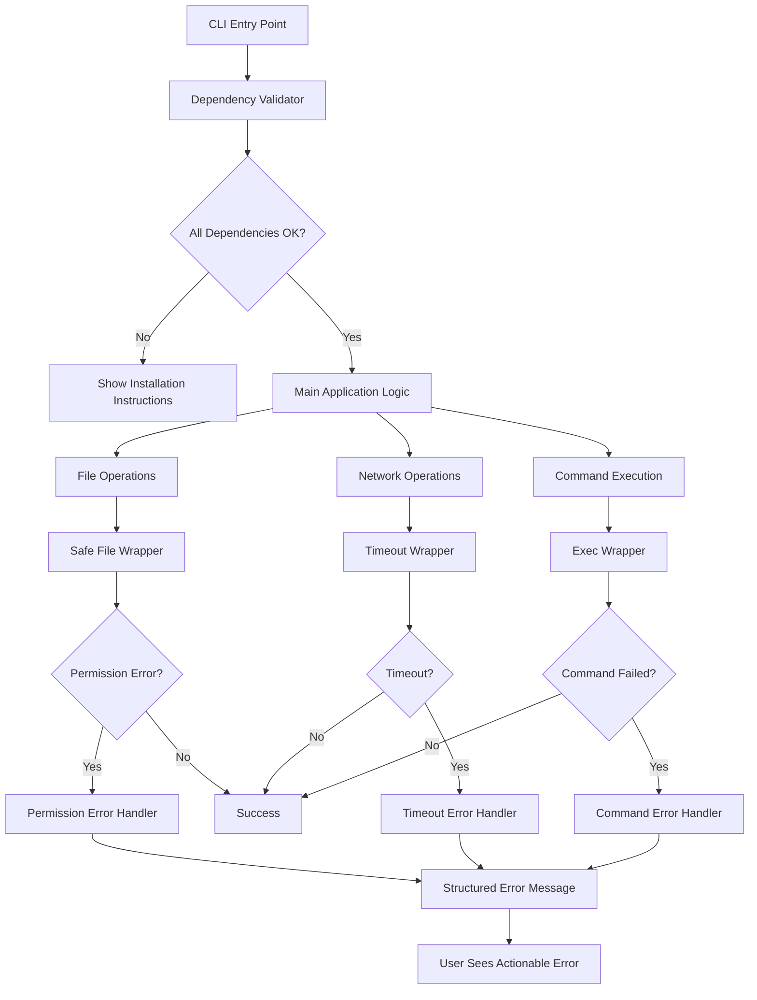
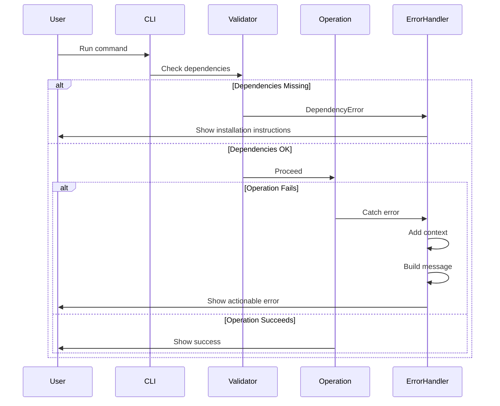

# Design Document: Error Handling Improvements

## Project Overview
**Issue:** #5  
**Branch:** `5-improve-error-handling`  
**Requirements:** See `requirements.md`

This design implements comprehensive error handling to transform cryptic failures into actionable guidance, enabling users to self-diagnose and resolve issues without external support.

---

## End-User Success Enablement

### How This Design Achieves User Success

**For First-Time Users:**
- Dependency checks at startup prevent wasted time on missing tools
- Installation links in errors enable immediate resolution
- Clear prerequisites reduce setup friction

**For Developers:**
- Permission errors show exact files and fix commands
- No need to dig through stack traces or documentation
- Errors provide copy-paste solutions

**For CI/CD Operators:**
- Timeout protection prevents hung pipelines
- Actionable logs enable remote debugging
- Consistent error format aids log parsing

**For All Users:**
- Every error answers: What? Why? How to fix?
- Context (paths, commands) eliminates guesswork
- Recovery steps are specific and testable

---

## System Architecture

### High-Level Architecture



### Error Handling Flow




---

## Component Design

### 1. Dependency Validator Module

**Purpose:** Validate required tools before operations begin  
**Enables User Success:** Users discover missing tools immediately with installation guidance

**Location:** `src/utils/dependencies.ts`

**Interface:**
```typescript
interface DependencyCheck {
  name: string;
  check: () => Promise<boolean>;
  errorMessage: string;
  installUrl?: string;
  installCommand?: string;
}

interface ValidationResult {
  success: boolean;
  failures: DependencyCheck[];
}

async function validateDependencies(
  checks: DependencyCheck[]
): Promise<ValidationResult>
```

**Implementation Details:**
- Runs all checks in parallel for speed (< 1 second total)
- Caches results for session to avoid repeated checks
- Returns all failures at once (not fail-fast) so users see complete picture
- Each check is independent and testable

**Checks to Implement:**
1. **gh CLI Check**
   - Command: `gh --version`
   - Error: "GitHub CLI (gh) not found"
   - Install: https://cli.github.com
   - Command: `brew install gh` (macOS), `apt install gh` (Linux)

2. **gh Auth Check**
   - Command: `gh auth status`
   - Error: "GitHub CLI not authenticated"
   - Fix: `gh auth login`

3. **Node.js Version Check**
   - Check: `process.version`
   - Error: "Node.js version X.X.X is too old (requires >= 18.0.0)"
   - Install: https://nodejs.org

**User Experience:**
```
❌ Missing required dependencies:

1. GitHub CLI (gh) not found
   Install: https://cli.github.com
   Or run: brew install gh

2. Node.js version 16.0.0 is too old (requires >= 18.0.0)
   Upgrade: https://nodejs.org

Please install missing dependencies and try again.
```

---

### 2. Safe File Operations Module

**Purpose:** Wrap file operations with permission error handling  
**Enables User Success:** Users see exact files and fix commands when permissions fail

**Location:** `src/utils/safeFs.ts`

**Interface:**
```typescript
interface FileError {
  type: 'permission' | 'not-found' | 'unknown';
  path: string;
  operation: 'read' | 'write' | 'list';
  originalError: Error;
  fixCommand?: string;
}

function safeReadFile(path: string): string | FileError
function safeWriteFile(path: string, content: string): void | FileError
function safeReadDir(path: string): string[] | FileError
function safeExists(path: string): boolean
```

**Implementation Details:**
- Catch `EACCES`, `EPERM` errors specifically
- Catch `ENOENT` for not-found errors
- Preserve original error for debugging
- Generate appropriate `chmod` commands based on operation
- Return errors as values (not throw) for easier handling

**Error Message Format:**
```
❌ Permission denied reading file: /path/to/.env

The file exists but cannot be read due to insufficient permissions.

Fix: chmod 644 /path/to/.env

Or if you need to read it as another user:
sudo chmod 644 /path/to/.env
```

**User Experience Benefits:**
- Exact file path shown (no guessing)
- Specific permission needed (644 for read, 755 for directories)
- Copy-paste fix command
- Alternative solutions (sudo) when applicable

---

### 3. Timeout Wrapper Module

**Purpose:** Prevent infinite hangs on network operations  
**Enables User Success:** Users get timely feedback instead of waiting indefinitely

**Location:** `src/utils/timeout.ts`

**Interface:**
```typescript
interface TimeoutOptions {
  timeout?: number; // milliseconds
  signal?: AbortSignal;
}

interface TimeoutError extends Error {
  name: 'TimeoutError';
  operation: string;
  duration: number;
}

async function withTimeout<T>(
  operation: () => Promise<T>,
  options: TimeoutOptions
): Promise<T>

async function execWithTimeout(
  command: string,
  options?: TimeoutOptions & { cwd?: string }
): Promise<{ stdout: string; stderr: string }>
```

**Implementation Details:**
- Default timeout: 30 seconds (configurable via `SECRETS_SYNC_TIMEOUT`)
- Use `AbortController` for clean cancellation
- Wrap all `exec()` calls for external commands
- Wrap all GitHub API calls
- Clear timeout on success to prevent memory leaks

**Configuration:**
```bash
# Set custom timeout (in milliseconds)
export SECRETS_SYNC_TIMEOUT=60000  # 60 seconds

# Or per-command
SECRETS_SYNC_TIMEOUT=10000 secrets-sync --env staging
```

**Error Message Format:**
```
❌ Operation timed out after 30 seconds: GitHub API call

The operation took too long to complete. This usually indicates:
- Slow network connection
- GitHub API is experiencing issues
- Firewall blocking the connection

Suggestions:
- Check your internet connection
- Try again in a few moments
- Check GitHub status: https://www.githubstatus.com
- Increase timeout: SECRETS_SYNC_TIMEOUT=60000 secrets-sync ...
```

**User Experience Benefits:**
- No infinite hangs (users stay in control)
- Clear indication of what timed out
- Actionable troubleshooting steps
- Configurable for slow networks


---

### 4. Error Class Hierarchy

**Purpose:** Type-safe error handling with consistent structure  
**Enables User Success:** Errors are categorized and handled appropriately

**Location:** `src/utils/errors.ts`

**Class Hierarchy:**
```typescript
class AppError extends Error {
  constructor(
    message: string,
    public readonly context?: Record<string, any>
  ) {
    super(message);
    this.name = this.constructor.name;
  }
}

class DependencyError extends AppError {
  constructor(
    public readonly dependency: string,
    public readonly installUrl?: string,
    public readonly installCommand?: string
  ) {
    super(`Missing dependency: ${dependency}`);
  }
}

class PermissionError extends AppError {
  constructor(
    public readonly path: string,
    public readonly operation: 'read' | 'write' | 'list',
    public readonly fixCommand: string
  ) {
    super(`Permission denied: ${operation} ${path}`);
  }
}

class TimeoutError extends AppError {
  constructor(
    public readonly operation: string,
    public readonly duration: number
  ) {
    super(`Operation timed out after ${duration}ms: ${operation}`);
  }
}

class ValidationError extends AppError {
  constructor(
    message: string,
    public readonly field?: string
  ) {
    super(message);
  }
}
```

**Benefits:**
- Type-safe error handling with `instanceof` checks
- Structured data for programmatic access
- Consistent error properties across types
- Easy to extend for new error types

---

### 5. Error Message Builder

**Purpose:** Generate consistent, actionable error messages  
**Enables User Success:** Every error follows same format with recovery steps

**Location:** `src/utils/errorMessages.ts`

**Interface:**
```typescript
interface ErrorMessageParts {
  what: string;        // What failed
  why: string;         // Why it failed
  howToFix: string;    // How to fix it
  context?: Record<string, any>;  // Additional context
}

function buildErrorMessage(parts: ErrorMessageParts): string

function formatDependencyError(error: DependencyError): string
function formatPermissionError(error: PermissionError): string
function formatTimeoutError(error: TimeoutError): string
```

**Message Template:**
```
❌ {what}

{why}

{howToFix}

{context (if present)}
```

**Example Output:**
```
❌ Failed to read .env file: /config/env/.env.production

The file exists but cannot be read due to insufficient permissions.

Fix: chmod 644 /config/env/.env.production

Context:
- Current user: developer
- File owner: root
- File permissions: -rw-------
```

**Implementation Details:**
- Use ANSI colors: red for ❌, yellow for warnings, blue for info
- Keep "what" concise (one line)
- Make "why" explanatory but brief
- Make "how to fix" actionable and specific
- Include context only when helpful

---

## Integration Points

### Existing Code Integration

**Where to Add Dependency Checks:**
```typescript
// src/secrets-sync.ts - main() function
async function main() {
  // Add at the very start
  const validation = await validateDependencies([
    ghCliCheck,
    ghAuthCheck,
    nodeVersionCheck
  ]);
  
  if (!validation.success) {
    console.error(formatDependencyErrors(validation.failures));
    process.exit(1);
  }
  
  // Continue with existing logic...
}
```

**Where to Add File Operation Wrappers:**
```typescript
// Replace all fs.readFileSync calls
// Before:
const content = fs.readFileSync(path, 'utf-8');

// After:
const result = safeReadFile(path);
if (result instanceof FileError) {
  console.error(formatPermissionError(result));
  process.exit(1);
}
const content = result;
```

**Where to Add Timeout Wrappers:**
```typescript
// Replace all exec() calls
// Before:
const { stdout } = await exec('gh api ...');

// After:
const { stdout } = await execWithTimeout('gh api ...', {
  timeout: getTimeout()
});
```

---

## Implementation Phases

### Phase 1: Foundation (Days 1-2)

**Goal:** Create reusable error handling infrastructure

**Tasks:**
1. Create error class hierarchy (`src/utils/errors.ts`)
2. Create error message builder (`src/utils/errorMessages.ts`)
3. Write unit tests for error classes
4. Write unit tests for message builder

**Deliverables:**
- Error classes with proper inheritance
- Message builder with consistent formatting
- 100% test coverage for utilities

**Validation:**
- Developers can create typed errors
- Error messages follow consistent format
- All tests pass

---

### Phase 2: Dependency Validation (Days 3-4)

**Goal:** Catch missing dependencies before operations

**Tasks:**
1. Create dependency validator module (`src/utils/dependencies.ts`)
2. Implement gh CLI check
3. Implement gh auth check
4. Implement Node.js version check
5. Integrate into main() function
6. Write integration tests

**Deliverables:**
- Dependency checks run at startup
- Clear error messages with installation links
- Tests for each dependency check

**Validation:**
- Users see missing dependencies immediately
- Installation instructions are accurate
- Tests cover all dependency scenarios

**User Success Metric:**
- Users can install missing tools without reading docs

---

### Phase 3: File Operation Safety (Days 5-6)

**Goal:** Handle permission errors gracefully

**Tasks:**
1. Create safe file operations module (`src/utils/safeFs.ts`)
2. Implement safeReadFile with error handling
3. Implement safeWriteFile with error handling
4. Implement safeReadDir with error handling
5. Replace all fs calls in codebase
6. Write integration tests with permission-denied files

**Deliverables:**
- All file operations use safe wrappers
- Permission errors show file paths and fix commands
- Tests for read/write/list permission errors

**Validation:**
- Users see exact files with permission issues
- chmod commands are correct and copy-pasteable
- Tests verify error messages

**User Success Metric:**
- Users can fix permission errors without trial-and-error

---

### Phase 4: Network Timeout Protection (Days 7-8)

**Goal:** Prevent infinite hangs on network operations

**Tasks:**
1. Create timeout wrapper module (`src/utils/timeout.ts`)
2. Implement withTimeout utility
3. Implement execWithTimeout wrapper
4. Add timeout configuration via env var
5. Replace all exec() calls with execWithTimeout
6. Write integration tests with simulated delays

**Deliverables:**
- All network operations have timeouts
- Timeout errors are clear and actionable
- Timeout is configurable
- Tests verify timeout behavior

**Validation:**
- Operations timeout after configured duration
- Users see what operation timed out
- Tests verify timeout and error messages

**User Success Metric:**
- Users never experience infinite hangs
- Users can adjust timeout for slow networks

---

### Phase 5: Integration & Polish (Days 9-10)

**Goal:** Ensure all error handling works together

**Tasks:**
1. Review all error messages for consistency
2. Add error context where missing
3. Update documentation with troubleshooting guide
4. Run full regression test suite
5. Performance test dependency checks (< 1 second)
6. User acceptance testing

**Deliverables:**
- All error messages follow consistent format
- Documentation includes common errors and fixes
- All tests pass
- Performance requirements met

**Validation:**
- Manual review of all error scenarios
- Documentation is complete and accurate
- No regressions in existing functionality

**User Success Metric:**
- Users can resolve 90% of errors without external help


---

## Testing Strategy

### Unit Tests

**Error Classes (`tests/unit/errors.test.ts`)**
```typescript
describe('Error Classes', () => {
  test('DependencyError includes install info', () => {
    const error = new DependencyError('gh', 'https://cli.github.com', 'brew install gh');
    expect(error.dependency).toBe('gh');
    expect(error.installUrl).toBe('https://cli.github.com');
    expect(error.installCommand).toBe('brew install gh');
  });
  
  test('PermissionError includes fix command', () => {
    const error = new PermissionError('/path/file', 'read', 'chmod 644 /path/file');
    expect(error.path).toBe('/path/file');
    expect(error.operation).toBe('read');
    expect(error.fixCommand).toBe('chmod 644 /path/file');
  });
});
```

**Message Builder (`tests/unit/errorMessages.test.ts`)**
```typescript
describe('Error Message Builder', () => {
  test('builds consistent format', () => {
    const message = buildErrorMessage({
      what: 'Failed to read file',
      why: 'Permission denied',
      howToFix: 'chmod 644 file.txt'
    });
    
    expect(message).toContain('❌ Failed to read file');
    expect(message).toContain('Permission denied');
    expect(message).toContain('chmod 644 file.txt');
  });
  
  test('includes context when provided', () => {
    const message = buildErrorMessage({
      what: 'Operation failed',
      why: 'Timeout',
      howToFix: 'Retry',
      context: { duration: 30000 }
    });
    
    expect(message).toContain('duration: 30000');
  });
});
```

**Dependency Validator (`tests/unit/dependencies.test.ts`)**
```typescript
describe('Dependency Validator', () => {
  test('detects missing gh CLI', async () => {
    // Mock exec to simulate missing gh
    mockExec.mockRejectedValue(new Error('command not found'));
    
    const result = await validateDependencies([ghCliCheck]);
    
    expect(result.success).toBe(false);
    expect(result.failures).toHaveLength(1);
    expect(result.failures[0].name).toBe('gh');
  });
  
  test('validates Node.js version', async () => {
    // Mock process.version
    Object.defineProperty(process, 'version', { value: 'v16.0.0' });
    
    const result = await validateDependencies([nodeVersionCheck]);
    
    expect(result.success).toBe(false);
  });
  
  test('caches validation results', async () => {
    await validateDependencies([ghCliCheck]);
    await validateDependencies([ghCliCheck]);
    
    // exec should only be called once
    expect(mockExec).toHaveBeenCalledTimes(1);
  });
});
```

---

### Integration Tests

**File Permission Errors (`tests/integration/filePermissions.test.ts`)**
```typescript
describe('File Permission Handling', () => {
  let testDir: string;
  
  beforeEach(() => {
    testDir = fs.mkdtempSync(path.join(os.tmpdir(), 'test-'));
  });
  
  afterEach(() => {
    fs.rmSync(testDir, { recursive: true, force: true });
  });
  
  test('handles unreadable file', () => {
    const file = path.join(testDir, 'secret.env');
    fs.writeFileSync(file, 'SECRET=value');
    fs.chmodSync(file, 0o000); // No permissions
    
    const result = safeReadFile(file);
    
    expect(result).toBeInstanceOf(FileError);
    expect(result.type).toBe('permission');
    expect(result.fixCommand).toContain('chmod 644');
  });
  
  test('handles read-only directory', () => {
    fs.chmodSync(testDir, 0o555); // Read-only
    
    const file = path.join(testDir, 'new.env');
    const result = safeWriteFile(file, 'content');
    
    expect(result).toBeInstanceOf(FileError);
    expect(result.type).toBe('permission');
    expect(result.fixCommand).toContain('chmod 755');
  });
});
```

**Timeout Behavior (`tests/integration/timeout.test.ts`)**
```typescript
describe('Timeout Protection', () => {
  test('times out slow operations', async () => {
    const slowOp = () => new Promise(resolve => 
      setTimeout(resolve, 60000) // 60 seconds
    );
    
    await expect(
      withTimeout(slowOp, { timeout: 1000 })
    ).rejects.toThrow(TimeoutError);
  });
  
  test('respects custom timeout from env var', async () => {
    process.env.SECRETS_SYNC_TIMEOUT = '5000';
    
    const slowOp = () => new Promise(resolve => 
      setTimeout(resolve, 10000)
    );
    
    const start = Date.now();
    await expect(withTimeout(slowOp, {})).rejects.toThrow();
    const duration = Date.now() - start;
    
    expect(duration).toBeLessThan(6000);
    expect(duration).toBeGreaterThan(4000);
  });
  
  test('cleans up on success', async () => {
    const fastOp = () => Promise.resolve('done');
    
    const result = await withTimeout(fastOp, { timeout: 1000 });
    
    expect(result).toBe('done');
    // Verify no memory leaks (timeout cleared)
  });
});
```

**Missing Dependencies (`tests/integration/dependencies.test.ts`)**
```typescript
describe('Dependency Validation Integration', () => {
  test('CLI fails gracefully without gh', async () => {
    // Mock gh command to fail
    mockExec.mockImplementation((cmd) => {
      if (cmd.includes('gh')) {
        throw new Error('command not found: gh');
      }
    });
    
    const exitCode = await runCLI(['--env', 'staging']);
    
    expect(exitCode).toBe(1);
    expect(mockConsoleError).toHaveBeenCalledWith(
      expect.stringContaining('GitHub CLI (gh) not found')
    );
    expect(mockConsoleError).toHaveBeenCalledWith(
      expect.stringContaining('https://cli.github.com')
    );
  });
});
```

---

### End-to-End Tests

**Complete Error Scenarios (`tests/e2e/errorHandling.test.ts`)**
```typescript
describe('Error Handling E2E', () => {
  test('user journey: missing gh CLI', async () => {
    // Simulate fresh install without gh
    mockExec.mockRejectedValue(new Error('command not found'));
    
    const output = await runCLI(['--help']);
    
    // User sees clear error
    expect(output.stderr).toContain('GitHub CLI (gh) not found');
    expect(output.stderr).toContain('Install: https://cli.github.com');
    expect(output.exitCode).toBe(1);
  });
  
  test('user journey: permission denied on .env', async () => {
    // Create unreadable .env file
    const envFile = 'config/env/.env';
    fs.writeFileSync(envFile, 'SECRET=value');
    fs.chmodSync(envFile, 0o000);
    
    const output = await runCLI(['--dry-run']);
    
    // User sees file path and fix
    expect(output.stderr).toContain(envFile);
    expect(output.stderr).toContain('chmod 644');
    expect(output.exitCode).toBe(1);
  });
  
  test('user journey: network timeout', async () => {
    // Simulate slow GitHub API
    mockExec.mockImplementation(() => 
      new Promise(resolve => setTimeout(resolve, 60000))
    );
    
    const output = await runCLI(['--env', 'staging'], {
      env: { SECRETS_SYNC_TIMEOUT: '1000' }
    });
    
    // User sees timeout error with suggestions
    expect(output.stderr).toContain('timed out after');
    expect(output.stderr).toContain('Check your internet connection');
    expect(output.exitCode).toBe(1);
  });
});
```

---

### Test Coverage Goals

**Minimum Coverage:**
- Unit tests: 100% of error handling utilities
- Integration tests: 90% of error scenarios
- E2E tests: All critical user journeys

**Coverage by Component:**
- Error classes: 100%
- Message builder: 100%
- Dependency validator: 95%
- Safe file operations: 95%
- Timeout wrapper: 95%

**Test Execution:**
```bash
# Run all tests
bun test

# Run with coverage
bun test --coverage

# Run specific test suite
bun test tests/unit/errors.test.ts

# Run integration tests only
bun test tests/integration/
```

---

## Performance Considerations

### Dependency Check Performance

**Requirement:** Complete in < 1 second

**Optimization Strategies:**
1. Run checks in parallel using `Promise.all()`
2. Cache results for session duration
3. Use fast commands (`gh --version` not `gh api`)
4. Skip checks if `SKIP_DEPENDENCY_CHECK=1` (for CI)

**Measurement:**
```typescript
const start = Date.now();
await validateDependencies(checks);
const duration = Date.now() - start;
expect(duration).toBeLessThan(1000);
```

### Error Message Generation

**Requirement:** Negligible overhead (< 1ms)

**Optimization:**
- Pre-compute static parts of messages
- Use template literals (fast)
- Avoid complex formatting logic
- Cache formatted messages when possible

### Timeout Implementation

**Requirement:** No memory leaks

**Safeguards:**
- Always clear timeouts on completion
- Use `AbortController` for clean cancellation
- Test for memory leaks in long-running scenarios


---

## API Design for Developers

### What Developers Should Be Able to Do

**1. Create Custom Error Types**
```typescript
// Extend base error class
class CustomError extends AppError {
  constructor(message: string, public readonly customField: string) {
    super(message, { customField });
  }
}

// Use in code
throw new CustomError('Something failed', 'additional-info');
```

**2. Handle Errors Consistently**
```typescript
// Pattern for error handling
try {
  const result = await riskyOperation();
} catch (error) {
  if (error instanceof DependencyError) {
    console.error(formatDependencyError(error));
  } else if (error instanceof PermissionError) {
    console.error(formatPermissionError(error));
  } else {
    console.error(formatGenericError(error));
  }
  process.exit(1);
}
```

**3. Add Context to Errors**
```typescript
// Wrap errors with additional context
try {
  await operation();
} catch (error) {
  throw new AppError(
    'Failed to sync secrets',
    {
      originalError: error,
      environment: 'staging',
      timestamp: new Date().toISOString()
    }
  );
}
```

**4. Validate Functionality**
```typescript
// Developers can test error handling
describe('My Feature', () => {
  test('handles missing dependencies', async () => {
    mockDependencyCheck.mockResolvedValue({ success: false });
    
    await expect(myFeature()).rejects.toThrow(DependencyError);
  });
  
  test('handles permission errors', async () => {
    mockFs.readFileSync.mockImplementation(() => {
      throw Object.assign(new Error('EACCES'), { code: 'EACCES' });
    });
    
    const result = safeReadFile('file.txt');
    expect(result).toBeInstanceOf(FileError);
  });
});
```

---

## Migration Guide

### Migrating Existing Code

**Step 1: Add Dependency Checks**
```typescript
// Before
async function main() {
  const args = parseArgs();
  await syncSecrets(args);
}

// After
async function main() {
  // Add at start
  const validation = await validateDependencies([
    ghCliCheck,
    ghAuthCheck,
    nodeVersionCheck
  ]);
  
  if (!validation.success) {
    console.error(formatDependencyErrors(validation.failures));
    process.exit(1);
  }
  
  const args = parseArgs();
  await syncSecrets(args);
}
```

**Step 2: Replace File Operations**
```typescript
// Before
function loadEnvFile(path: string): Record<string, string> {
  const content = fs.readFileSync(path, 'utf-8');
  return parseEnv(content);
}

// After
function loadEnvFile(path: string): Record<string, string> {
  const result = safeReadFile(path);
  
  if (result instanceof FileError) {
    console.error(formatPermissionError(result));
    process.exit(1);
  }
  
  return parseEnv(result);
}
```

**Step 3: Add Timeouts to Commands**
```typescript
// Before
async function callGitHubAPI(endpoint: string): Promise<any> {
  const { stdout } = await exec(`gh api ${endpoint}`);
  return JSON.parse(stdout);
}

// After
async function callGitHubAPI(endpoint: string): Promise<any> {
  try {
    const { stdout } = await execWithTimeout(`gh api ${endpoint}`, {
      timeout: getTimeout()
    });
    return JSON.parse(stdout);
  } catch (error) {
    if (error instanceof TimeoutError) {
      console.error(formatTimeoutError(error));
      process.exit(1);
    }
    throw error;
  }
}
```

---

## Backward Compatibility

### Ensuring No Breaking Changes

**Exit Codes:**
- Maintain existing exit codes (0 = success, 1 = error)
- Don't introduce new exit codes

**Command-Line Interface:**
- Don't change existing flags or arguments
- Don't change output format for success cases
- Only enhance error output

**Environment Variables:**
- New: `SECRETS_SYNC_TIMEOUT` (optional)
- New: `SKIP_DEPENDENCY_CHECK` (optional, for CI)
- Don't break existing env var behavior

**Error Handling:**
- Enhance error messages (not breaking)
- Add new error types (not breaking)
- Maintain existing error behavior as fallback

---

## Rollout Strategy

### Phase 1: Internal Testing (Week 1)
- Deploy to development branch
- Test all error scenarios manually
- Gather feedback from team
- Fix any issues found

### Phase 2: Beta Testing (Week 2)
- Deploy to staging environment
- Monitor error logs
- Collect user feedback
- Measure success metrics

### Phase 3: Production Rollout (Week 3)
- Deploy to main branch
- Publish new version to npm
- Update documentation
- Monitor for issues

### Success Metrics

**Quantitative:**
- Error resolution time < 5 minutes (down from 30+ minutes)
- Support tickets for "cryptic errors" reduced by 80%
- Dependency check completes in < 1 second
- Zero infinite hangs reported

**Qualitative:**
- Users report errors are "clear and helpful"
- Developers can debug issues from logs alone
- New users successfully install dependencies
- CI/CD operators can diagnose failures remotely

---

## Documentation Updates

### User-Facing Documentation

**README.md Updates:**
- Add "Troubleshooting" section with common errors
- Document `SECRETS_SYNC_TIMEOUT` environment variable
- Add examples of error messages and fixes

**New Troubleshooting Guide:**
```markdown
## Common Errors

### "GitHub CLI (gh) not found"
**Cause:** The `gh` CLI tool is not installed.
**Fix:** Install from https://cli.github.com
**Command:** `brew install gh` (macOS) or `apt install gh` (Linux)

### "Permission denied reading file"
**Cause:** The file exists but you don't have read permissions.
**Fix:** Run the `chmod` command shown in the error message.
**Example:** `chmod 644 /path/to/file`

### "Operation timed out after 30 seconds"
**Cause:** Network operation took too long (slow connection or API issues).
**Fix:** 
1. Check your internet connection
2. Try again in a few moments
3. Increase timeout: `SECRETS_SYNC_TIMEOUT=60000 secrets-sync ...`
```

### Developer Documentation

**CONTRIBUTING.md Updates:**
- Document error handling patterns
- Show how to add new error types
- Explain testing requirements for errors

**API Documentation:**
- Document all error classes
- Show usage examples
- Explain error handling best practices

---

## Monitoring and Observability

### Error Tracking

**What to Log:**
- Error type and message
- Stack trace (in verbose mode)
- Context (file paths, commands, environment)
- Timestamp
- User's Node.js version
- User's OS

**Log Format:**
```
[2025-11-25T08:00:00.000Z] [ERROR] DependencyError: GitHub CLI (gh) not found
Context: {
  "nodeVersion": "v20.0.0",
  "platform": "darwin",
  "command": "secrets-sync --env staging"
}
```

### Success Metrics Dashboard

**Track:**
- Error frequency by type
- Average time to resolution
- Dependency check performance
- Timeout occurrences
- User feedback sentiment

---

## Risk Mitigation

### Potential Risks

**Risk 1: Performance Degradation**
- **Mitigation:** Benchmark dependency checks (< 1 second requirement)
- **Fallback:** Add `SKIP_DEPENDENCY_CHECK=1` for CI environments

**Risk 2: False Positives**
- **Mitigation:** Test dependency checks thoroughly
- **Fallback:** Allow users to skip checks if needed

**Risk 3: Breaking Changes**
- **Mitigation:** Comprehensive regression testing
- **Fallback:** Maintain backward compatibility layer

**Risk 4: Timeout Too Aggressive**
- **Mitigation:** Make timeout configurable
- **Fallback:** Default to 30 seconds (reasonable for most networks)

---

## Definition of Done Checklist

- [ ] All error classes implemented and tested
- [ ] Message builder creates consistent format
- [ ] Dependency validator checks all required tools
- [ ] File operations use safe wrappers
- [ ] Network operations have timeout protection
- [ ] All error messages include: what, why, how to fix
- [ ] Integration tests cover all error scenarios
- [ ] E2E tests validate user journeys
- [ ] Performance requirements met (< 1 second checks)
- [ ] Documentation updated (README, troubleshooting guide)
- [ ] No regressions in existing functionality
- [ ] Code review completed
- [ ] User acceptance testing passed

---

## Appendix: Error Message Examples

### Complete Error Message Catalog

**Missing gh CLI:**
```
❌ GitHub CLI (gh) not found

The 'gh' command is required for GitHub operations but is not installed.

Install: https://cli.github.com

Or run:
  macOS:   brew install gh
  Linux:   apt install gh
  Windows: winget install GitHub.cli

After installing, authenticate with: gh auth login
```

**Unauthenticated gh CLI:**
```
❌ GitHub CLI not authenticated

The 'gh' command is installed but you haven't logged in yet.

Fix: gh auth login

This will open your browser to authenticate with GitHub.
```

**Old Node.js Version:**
```
❌ Node.js version 16.0.0 is too old

This tool requires Node.js >= 18.0.0 but you have 16.0.0 installed.

Upgrade: https://nodejs.org

Or use a version manager:
  nvm:  nvm install 18
  fnm:  fnm install 18
```

**Permission Denied (Read):**
```
❌ Permission denied reading file: /config/env/.env.production

The file exists but cannot be read due to insufficient permissions.

Fix: chmod 644 /config/env/.env.production

Or if you need to read it as another user:
  sudo chmod 644 /config/env/.env.production

Current permissions: -rw------- (owner: root, you: developer)
```

**Permission Denied (Write):**
```
❌ Permission denied writing file: /config/env/.env.staging

Cannot write to this location due to insufficient permissions.

Fix: chmod 755 /config/env

Or create the directory with proper permissions:
  mkdir -p /config/env
  chmod 755 /config/env
```

**Network Timeout:**
```
❌ Operation timed out after 30 seconds: GitHub API call

The operation took too long to complete. This usually indicates:
- Slow network connection
- GitHub API is experiencing issues  
- Firewall blocking the connection

Suggestions:
1. Check your internet connection
2. Try again in a few moments
3. Check GitHub status: https://www.githubstatus.com
4. Increase timeout: SECRETS_SYNC_TIMEOUT=60000 secrets-sync ...
```


---

### 6. Error Message Catalog

**Purpose:** Centralized storage of all error messages with error codes  
**Enables User Success:** Consistent messaging, easier maintenance, future i18n support

**Location:** `src/messages/errors.json`

**Structure:**
```json
{
  "ERR_DEPENDENCY_MISSING": {
    "what": "Missing dependency: {dependency}",
    "why": "The '{dependency}' command is required but not installed",
    "howToFix": "Install from {installUrl}\nOr run: {installCommand}",
    "context": ["dependency", "installUrl", "installCommand"]
  },
  "ERR_PERMISSION_DENIED": {
    "what": "Permission denied: {operation} {path}",
    "why": "Insufficient permissions to {operation} this file",
    "howToFix": "Fix: {fixCommand}",
    "context": ["operation", "path", "fixCommand"]
  },
  "ERR_TIMEOUT": {
    "what": "Operation timed out after {duration}ms: {operation}",
    "why": "The operation took too long to complete",
    "howToFix": "Check your internet connection\nTry again in a few moments\nIncrease timeout: SECRETS_SYNC_TIMEOUT={suggestedTimeout} secrets-sync ...",
    "context": ["duration", "operation", "suggestedTimeout"]
  },
  "ERR_NODE_VERSION": {
    "what": "Node.js version {currentVersion} is too old",
    "why": "This tool requires Node.js >= {requiredVersion}",
    "howToFix": "Upgrade: https://nodejs.org\nOr use a version manager:\n  nvm: nvm install {requiredVersion}\n  fnm: fnm install {requiredVersion}",
    "context": ["currentVersion", "requiredVersion"]
  }
}
```

**Loading:**
```typescript
// Load at startup
const errorCatalog = JSON.parse(
  fs.readFileSync('src/messages/errors.json', 'utf-8')
);

// Validate catalog
function validateCatalog(catalog: Record<string, ErrorMessage>): void {
  for (const [code, message] of Object.entries(catalog)) {
    if (!code.startsWith('ERR_')) {
      throw new Error(`Invalid error code: ${code}`);
    }
    if (!message.what || !message.why || !message.howToFix) {
      throw new Error(`Invalid message structure: ${code}`);
    }
  }
}
```

**Usage:**
```typescript
// Get message with context
const message = getMessage('ERR_DEPENDENCY_MISSING', {
  dependency: 'gh',
  installUrl: 'https://cli.github.com',
  installCommand: 'brew install gh'
});

// Format for display
const formatted = formatError('ERR_DEPENDENCY_MISSING', context);
console.error(formatted);
```

**Benefits:**
- All messages in one place (easy to maintain)
- Consistent format enforced by structure
- Context interpolation prevents hardcoded values
- Enables future internationalization
- Easy to add new error types

**User Experience:**
```
❌ Missing dependency: gh

The 'gh' command is required but not installed.

Install from https://cli.github.com
Or run: brew install gh
```

---

### 7. Logger Module

**Purpose:** Centralized logging with consistent format and level support  
**Enables User Success:** Clear, consistent output; verbose mode for debugging

**Location:** `src/utils/logger.ts`

**Interface:**
```typescript
enum LogLevel {
  ERROR = 0,
  WARN = 1,
  INFO = 2,
  DEBUG = 3
}

interface LoggerOptions {
  verbose: boolean;
}

class Logger {
  private level: LogLevel;
  
  constructor(options: LoggerOptions) {
    this.level = options.verbose ? LogLevel.DEBUG : LogLevel.INFO;
  }
  
  private log(level: LogLevel, message: string, context?: Record<string, any>): void {
    if (level > this.level) return;
    
    const timestamp = new Date().toISOString();
    const levelName = LogLevel[level];
    const color = this.getColor(level);
    
    console.error(`${color}[${timestamp}] [${levelName}]${RESET} ${message}`);
    
    if (context && Object.keys(context).length > 0) {
      console.error('Context:', JSON.stringify(context, null, 2));
    }
  }
  
  error(message: string, context?: Record<string, any>): void {
    this.log(LogLevel.ERROR, message, context);
  }
  
  warn(message: string, context?: Record<string, any>): void {
    this.log(LogLevel.WARN, message, context);
  }
  
  info(message: string, context?: Record<string, any>): void {
    this.log(LogLevel.INFO, message, context);
  }
  
  debug(message: string, context?: Record<string, any>): void {
    this.log(LogLevel.DEBUG, message, context);
  }
  
  private getColor(level: LogLevel): string {
    switch (level) {
      case LogLevel.ERROR: return '\x1b[31m'; // Red
      case LogLevel.WARN: return '\x1b[33m';  // Yellow
      case LogLevel.INFO: return '\x1b[36m';  // Cyan
      case LogLevel.DEBUG: return '\x1b[90m'; // Gray
    }
  }
}

const RESET = '\x1b[0m';
```

**Format:**
```
[2025-11-25T12:00:00.000Z] [ERROR] message
Context: { key: value }
```

**Level Filtering:**
- Normal mode: ERROR, WARN, INFO
- Verbose mode: ERROR, WARN, INFO, DEBUG

**Usage:**
```typescript
const logger = new Logger({ verbose: flags.verbose });

logger.info('Starting dependency checks...');
logger.debug('Checking gh CLI...', { command: 'gh --version' });
logger.error('Dependency missing', { dependency: 'gh' });
```

**Benefits:**
- Consistent format across all output
- Level-based filtering
- Verbose mode for debugging
- Context data structured
- Colors for readability

---

### 8. Verbose Mode Handler

**Purpose:** Control debug output level based on CLI flag  
**Enables User Success:** Developers can troubleshoot without code changes

**CLI Flag:** `--verbose` or `-v`

**Integration:**
```typescript
// Add to Flags interface
interface Flags {
  // ... existing flags
  verbose?: boolean;
}

// Parse flag
const flags = parseArgs();
if (flags.verbose || flags.v) {
  flags.verbose = true;
}

// Create logger with verbose setting
const logger = new Logger({ verbose: flags.verbose ?? false });

// Use throughout application
try {
  logger.debug('Starting operation...', { operation: 'syncSecrets' });
  await operation();
  logger.info('Operation completed');
} catch (error) {
  logger.error(formatError(error));
  
  if (flags.verbose) {
    logger.debug('Stack trace:', { stack: error.stack });
    logger.debug('Error details:', { 
      name: error.name,
      message: error.message,
      context: error.context
    });
  }
  
  process.exit(1);
}
```

**Behavior:**
- **Normal mode:** Shows ERROR, WARN, INFO (concise, user-friendly)
- **Verbose mode:** Shows ERROR, WARN, INFO, DEBUG (detailed, for troubleshooting)
- **Stack traces:** Only shown in verbose mode
- **Timing info:** Only shown in verbose mode
- **Context data:** Full details in verbose mode

**User Experience:**

Normal mode:
```
[INFO] Starting dependency checks...
[INFO] All dependencies present
[INFO] Syncing secrets...
✓ Success
```

Verbose mode:
```
[INFO] Starting dependency checks...
[DEBUG] Checking gh CLI...
Context: { command: "gh --version" }
[DEBUG] gh version 2.40.0
[DEBUG] Checking Node.js version...
Context: { version: "v20.0.0", required: "18.0.0" }
[INFO] All dependencies present
[DEBUG] Loading .env files from config/env
[INFO] Syncing secrets...
[DEBUG] Processing .env.production (5 keys)
[DEBUG] Processing .env.staging (5 keys)
✓ Success
```

**Benefits:**
- No code changes needed for debugging
- Developers can see what's happening
- Production users get clean output
- Easy to diagnose issues remotely


---

## Component Updates

### Component 5: Error Message Builder (Updated)

**Purpose:** Load and format error messages from catalog  
**Change:** Now loads from catalog instead of building messages

**Updated Interface:**
```typescript
interface ErrorMessage {
  what: string;
  why: string;
  howToFix: string;
  context?: string[];
}

// Load message from catalog
function getMessage(
  errorCode: string,
  contextValues?: Record<string, any>
): ErrorMessage

// Format message for display
function formatError(
  errorCode: string,
  contextValues?: Record<string, any>
): string {
  const message = getMessage(errorCode, contextValues);
  
  // Interpolate context values
  const what = interpolate(message.what, contextValues);
  const why = interpolate(message.why, contextValues);
  const howToFix = interpolate(message.howToFix, contextValues);
  
  // Format with colors
  return `❌ ${what}\n\n${why}\n\n${howToFix}`;
}

// Interpolate {placeholder} with values
function interpolate(template: string, values?: Record<string, any>): string {
  if (!values) return template;
  
  return template.replace(/\{(\w+)\}/g, (match, key) => {
    return values[key]?.toString() ?? match;
  });
}
```

**Usage:**
```typescript
// Before (hardcoded)
const message = buildErrorMessage({
  what: 'Failed to read file',
  why: 'Permission denied',
  howToFix: 'chmod 644 file.txt'
});

// After (from catalog)
const message = formatError('ERR_PERMISSION_DENIED', {
  operation: 'read',
  path: '/path/to/file',
  fixCommand: 'chmod 644 /path/to/file'
});
```

**Benefits:**
- Messages centralized in catalog
- No hardcoded strings in code
- Consistent format guaranteed
- Easy to update messages
- Supports future i18n


---

## Design Decisions and Scope

### Cross-Platform Compatibility

**Decision:** Rely on Node.js/Bun runtime for cross-platform support

**Rationale:**
- Node.js `fs` module provides consistent APIs across Windows, macOS, Linux
- `chmod` operations work through Node.js on all platforms
- No need for platform-specific code paths
- Simpler implementation and maintenance

**Implementation:**
- Use Node.js `fs` module for all file operations
- Use Node.js `child_process` for command execution
- Test on multiple platforms but expect consistent behavior
- No platform detection or conditional logic needed

**User Impact:**
- Same commands work on all platforms
- Same error messages on all platforms
- Consistent user experience

---

### Error Recovery Strategy

**Decision:** Show fix information, do NOT implement auto-retry

**Rationale:**
- User maintains control over when to retry
- Avoids unexpected behavior (e.g., infinite loops)
- Simpler implementation
- Clear user intent (manual retry)

**Implementation:**
- Error messages include specific fix commands
- User applies fix manually
- User re-runs command after fixing
- No automatic retry logic in code

**User Impact:**
- User sees what went wrong
- User sees how to fix it
- User decides when to retry
- Predictable behavior

---

### Internationalization (i18n)

**Decision:** Out of scope for this issue

**Rationale:**
- Adds significant complexity
- Error message catalog provides foundation for future i18n
- Can be added later without major refactoring

**Future Path:**
- Message catalog already structured for i18n
- Add locale detection
- Add message files per locale
- Load appropriate catalog based on locale

**Current Implementation:**
- All messages in English
- Catalog structure supports future i18n
- Document as future enhancement

---

### Error Telemetry

**Decision:** Out of scope for this issue

**Rationale:**
- Privacy concerns require careful design
- Needs user consent mechanism
- Separate feature deserving its own design

**Alternative:**
- Add GitHub issue link in error messages
- Users can manually report issues
- Create separate enhancement issue for telemetry

**Implementation:**
- Add to error message footer: "Report issues: https://github.com/..."
- Create GitHub issue for future telemetry feature
- Document privacy considerations

---

### Exit Code Strategy

**Decision:** Keep exit code 1 for all errors

**Rationale:**
- Backward compatibility
- Simple for users
- Sufficient for most use cases
- CI/CD scripts typically only check success (0) vs failure (non-zero)

**Implementation:**
- Exit code 0: Success
- Exit code 1: Any error
- No differentiation by error type

**User Impact:**
- Consistent with existing behavior
- No breaking changes
- Simple to understand


---

## Updated Implementation Phases

### Phase 1: Foundation (Days 1-2.5)

**Goal:** Create reusable error handling infrastructure

**Tasks:**
1. Create error class hierarchy (`src/utils/errors.ts`)
2. Create error message catalog (`src/messages/errors.json`)
3. Create error message builder with catalog loading (`src/utils/errorMessages.ts`)
4. Create logger module (`src/utils/logger.ts`)
5. Add verbose flag to CLI
6. Write unit tests for all utilities

**Deliverables:**
- Error classes with proper inheritance
- Message catalog with all error types
- Message builder loads from catalog
- Logger with level support
- Verbose flag integrated
- 100% test coverage for utilities

**Validation:**
- Developers can create typed errors
- All errors use catalog (no hardcoded messages)
- Logger respects verbose flag
- All tests pass

**Time:** 2.5 days (was 2 days, +0.5 for catalog and logger)

---

### Phase 2: Dependency Validation (Days 3-4)

**Goal:** Catch missing dependencies before operations

**Tasks:**
1. Create dependency validator module
2. Implement gh CLI check
3. Implement gh auth check
4. Implement Node.js version check
5. Integrate into main() function
6. Add error messages to catalog
7. Write integration tests

**Deliverables:**
- Dependency checks run at startup
- Clear error messages from catalog
- Tests for each dependency check
- Verbose mode shows check details

**Validation:**
- Users see missing dependencies immediately
- Installation instructions are accurate
- Verbose mode shows debug info
- Tests cover all dependency scenarios

**User Success Metric:**
- Users can install missing tools without reading docs

**Time:** 2 days (unchanged)

---

### Phase 3: File Operation Safety (Days 5-6)

**Goal:** Handle permission errors gracefully

**Tasks:**
1. Create safe file operations module
2. Implement safeReadFile with error handling
3. Implement safeWriteFile with error handling
4. Implement safeReadDir with error handling
5. Replace all fs calls in codebase
6. Add error messages to catalog
7. Write integration tests with permission-denied files

**Deliverables:**
- All file operations use safe wrappers
- Permission errors show file paths and fix commands from catalog
- Tests for read/write/list permission errors
- Verbose mode shows file operation details

**Validation:**
- Users see exact files with permission issues
- chmod commands are correct and copy-pasteable
- Tests verify error messages
- Verbose mode aids debugging

**User Success Metric:**
- Users can fix permission errors without trial-and-error

**Time:** 2 days (unchanged)

---

### Phase 4: Network Timeout Protection (Days 7-8)

**Goal:** Prevent infinite hangs on network operations

**Tasks:**
1. Create timeout wrapper module
2. Implement withTimeout utility
3. Implement execWithTimeout wrapper
4. Add timeout configuration via env var
5. Replace all exec() calls with execWithTimeout
6. Add error messages to catalog
7. Write integration tests with simulated delays

**Deliverables:**
- All network operations have timeouts
- Timeout errors are clear and actionable from catalog
- Timeout is configurable
- Tests verify timeout behavior
- Verbose mode shows timing information

**Validation:**
- Operations timeout after configured duration
- Users see what operation timed out
- Tests verify timeout and error messages
- Verbose mode shows debug timing

**User Success Metric:**
- Users never experience infinite hangs
- Users can adjust timeout for slow networks

**Time:** 2 days (unchanged)

---

### Phase 5: Integration & Polish (Days 9-11.5)

**Goal:** Ensure all error handling works together

**Tasks:**
1. End-to-end testing with verbose mode
2. Error message consistency review (catalog validation)
3. Documentation updates
4. Add code quality metrics (jscpd, complexity-report)
5. Run full regression test suite
6. Performance test dependency checks (< 1 second)
7. User acceptance testing with verbose mode

**Deliverables:**
- All error messages in catalog follow consistent format
- Documentation includes verbose mode usage
- Code quality metrics configured and passing
- All tests pass
- Performance requirements met
- Verbose mode documented

**Validation:**
- Manual review of catalog messages
- Documentation is complete and accurate
- Code quality thresholds met
- No regressions in existing functionality
- Verbose mode helps debugging

**User Success Metric:**
- Users can resolve 90% of errors without external help
- Developers can debug issues with verbose mode

**Time:** 2.5 days (was 2 days, +0.5 for quality metrics)

---

## Updated Time Estimate

**Original:** 10 days  
**New Components:** +1 day (catalog, logger, verbose mode, quality metrics)  
**Total:** 11 days

**Breakdown:**
- Phase 1: 2.5 days (Foundation + new components)
- Phase 2: 2 days (Dependency validation)
- Phase 3: 2 days (File operation safety)
- Phase 4: 2 days (Network timeout protection)
- Phase 5: 2.5 days (Integration + quality metrics)


---

## Version History

**v1.0** - 2025-11-25 - Initial design  
**v1.1** - 2025-11-25 - Added Components 6-8 (catalog, logger, verbose mode), updated Component 5, added scope clarifications, updated phases

---

## Design Summary

### Components: 8
1. Dependency Validator Module
2. Safe File Operations Module
3. Timeout Wrapper Module
4. Error Class Hierarchy
5. Error Message Builder (updated to use catalog)
6. Error Message Catalog (new)
7. Logger Module (new)
8. Verbose Mode Handler (new)

### Key Architectural Decisions:
- Error messages centralized in JSON catalog
- Logger with level-based filtering
- Verbose mode for debugging
- Cross-platform via Node.js APIs
- No auto-retry (user control)
- Exit code 1 for all errors

### Out of Scope:
- Internationalization (future enhancement)
- Error telemetry (future enhancement)
- Concurrent execution testing
- Platform-specific code

### Implementation Ready: ✅
All components designed, all decisions made, ready for Phase 1 implementation.

