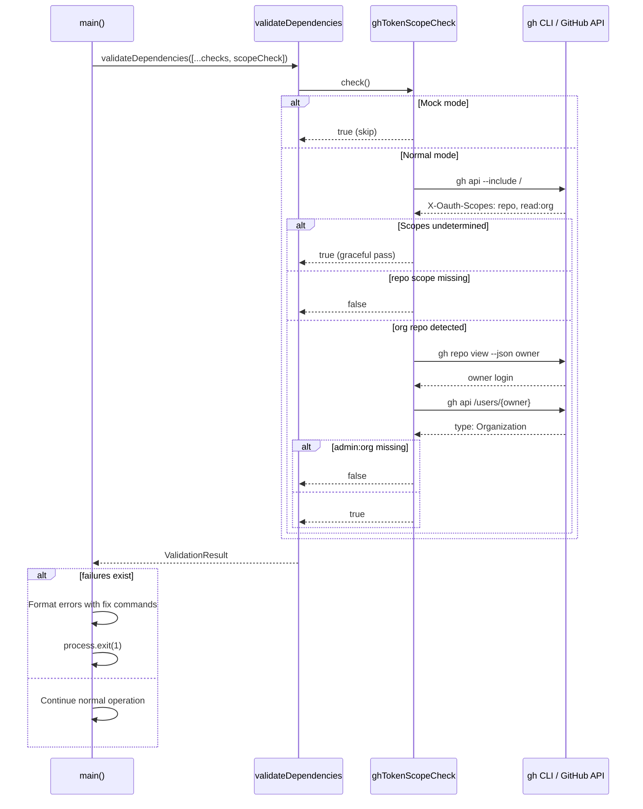

# Design: GitHub Token Scope Pre-flight Check

## Overview

Extend the existing `DependencyCheck` system with a `ghTokenScopeCheck` that detects missing GitHub token scopes before any secret mutation. Add a new error catalog entry `ERR_TOKEN_SCOPE` and enhance the `GhCliSecretsAdapter` error handler for runtime 403 detection.

---

## System Architecture

### Current Pre-flight Flow

```mermaid
graph TD
    A[main()] --> B[Parse flags]
    B --> C[Load env-config.yml]
    C --> D[validateDependencies]
    D --> E[nodeVersionCheck]
    D --> F[ghCliCheck]
    D --> G[ghAuthCheck]
    E & F & G --> H{All pass?}
    H -->|No| I[Format errors, exit 1]
    H -->|Yes| J[Continue: discover env files...]
    J --> K[Create adapter, diff, sync]
```

### New Pre-flight Flow

```mermaid
graph TD
    A[main()] --> B[Parse flags]
    B --> C[Load env-config.yml]
    C --> D[validateDependencies]
    D --> E[nodeVersionCheck]
    D --> F[ghCliCheck]
    D --> G[ghAuthCheck]
    D --> H[ghTokenScopeCheck]
    E & F & G & H --> I{All pass?}
    I -->|No| J[Format errors with fix commands, exit 1]
    I -->|Yes| K[Continue: discover env files...]
    K --> L[Create adapter, diff, sync]
    L -->|403 error| M[Enhanced error: suggest gh auth refresh]
```

---

## Technical Design

### 1. Scope Detection via API Header

**Method:** Use `gh api --include /` to fetch the `X-Oauth-Scopes` response header.

**Rationale:** The research brief confirms this is the most reliable method. It works across all gh CLI versions and reports the actual token scopes regardless of how the token was created.

```typescript
// Conceptual implementation
async function getTokenScopes(): Promise<string[] | null> {
  const { stdout } = await execWithTimeout(
    'gh api --include /',
    { operation: 'token scope check' }
  );
  const match = stdout.match(/x-oauth-scopes:\s*(.+)/i);
  if (!match) return null; // Fine-grained PAT or API failure
  return match[1].split(',').map(s => s.trim()).filter(Boolean);
}
```

**Returns `null` when scopes are undetermined** — signals graceful pass (REQ-006).

### 2. Organization Detection

**Method:** Two-step detection using `gh repo view` and `gh api /users/{owner}`.

```typescript
async function isOrgRepo(): Promise<boolean | null> {
  // Step 1: Get repo owner
  const { stdout: owner } = await execWithTimeout(
    'gh repo view --json owner --jq ".owner.login"',
    { operation: 'repo owner check' }
  );
  if (!owner.trim()) return null;

  // Step 2: Check if owner is an org
  const { stdout: type } = await execWithTimeout(
    `gh api /users/${owner.trim()} --jq ".type"`,
    { operation: 'owner type check' }
  );
  return type.trim() === 'Organization';
}
```

**Returns `null` on failure** — check passes gracefully when org status is undetermined.

### 3. ghTokenScopeCheck Implementation

**Location:** `src/utils/dependencies.ts`

```typescript
export const ghTokenScopeCheck: DependencyCheck = {
  name: 'gh-token-scope',
  check: async () => {
    // Skip in mock mode — no real GitHub interaction
    if (process.env.SECRETS_SYNC_MOCK === '1') return true;

    // Step 1: Get token scopes via API header
    const scopes = await getTokenScopes();
    if (scopes === null) {
      // Cannot determine scopes (fine-grained PAT, network issue)
      // Pass gracefully — runtime 403 handler provides fallback
      return true;
    }

    // Step 2: Check for `repo` scope (always required)
    if (!scopes.includes('repo')) {
      // Will fail — errorMessage contains fix command
      return false;
    }

    // Step 3: Check for `admin:org` if this is an org repo
    const isOrg = await isOrgRepo();
    if (isOrg === true && !scopes.includes('admin:org')) {
      // Will fail — errorMessage needs to mention admin:org
      return false;
    }

    return true;
  },
  errorMessage: '', // Dynamically set based on which scope is missing
  installCommand: 'gh auth refresh -s admin:org',
};
```

**Design decision: Dynamic error message.** The `DependencyCheck` interface uses a static `errorMessage` string. To provide scope-specific messaging, the check function will set a module-level variable indicating which scope failed, and the error message will be constructed accordingly. Alternatively, the check can throw a custom error that the validator captures.

**Revised approach:** Since the `DependencyCheck` interface has static fields, use a wrapper pattern:

```typescript
// Module-level state for the scope that failed
let missingScopeDetail: { scope: string; reason: string } | null = null;

export function getGhTokenScopeCheck(): DependencyCheck {
  missingScopeDetail = null;
  return {
    name: 'gh-token-scope',
    check: async () => {
      if (process.env.SECRETS_SYNC_MOCK === '1') return true;

      const scopes = await getTokenScopes();
      if (scopes === null) return true; // graceful pass

      if (!scopes.includes('repo')) {
        missingScopeDetail = {
          scope: 'repo',
          reason: 'Required for managing repository secrets'
        };
        return false;
      }

      const isOrg = await isOrgRepo();
      if (isOrg === true && !scopes.includes('admin:org')) {
        missingScopeDetail = {
          scope: 'admin:org',
          reason: 'Required for managing secrets on organization repositories'
        };
        return false;
      }

      return true;
    },
    get errorMessage() {
      const scope = missingScopeDetail?.scope || 'admin:org';
      const reason = missingScopeDetail?.reason || 'Required for managing secrets';
      return `GitHub token missing required scope: ${scope}. ${reason}`;
    },
    get installCommand() {
      const scope = missingScopeDetail?.scope || 'admin:org';
      return `gh auth refresh -s ${scope}`;
    },
  };
}
```

### 4. Error Catalog Entry

**Location:** `src/messages/errors.json`

```json
"ERR_TOKEN_SCOPE": {
  "what": "GitHub token missing required scope: {{scope}}",
  "why": "{{reason}}",
  "howToFix": "Run: gh auth refresh -s {{scope}}\nThis preserves existing scopes and adds the missing one."
}
```

### 5. Runtime 403 Error Enhancement

**Location:** `src/secrets-sync.ts`, `GhCliSecretsAdapter.set()` method

> **Note on `spawnSync` vs `execWithTimeout`:** The adapter methods (`set`, `delete`, `list`) intentionally use `spawnSync` — they are synchronous mutation-path operations that execute sequentially during the sync phase. The pre-flight scope check (§1, §2) uses `execWithTimeout` because it runs in an async context (`Promise.all` inside `validateDependencies`). Both patterns are correct for their respective contexts.

Enhance the existing error handler to detect scope-related 403 errors:

```typescript
async set(name: string, value: string): Promise<void> {
  const proc = spawnSync('gh', ['secret', 'set', name, '--body', value]);
  if (proc.status !== 0) {
    const stderr = proc.stderr?.toString() || '';
    
    // Detect scope-related 403 and enhance error message
    if (/403.*admin rights|Resource not accessible/i.test(stderr)) {
      throw new Error(
        `gh secret set ${name} failed: Token may be missing required scope.\n` +
        `   Fix: gh auth refresh -s admin:org\n` +
        `   Original error: ${stderr.trim()}`
      );
    }
    
    throw new Error(`gh secret set ${name} failed: ${stderr.trim()}`);
  }
}
```

### 6. Integration in main()

**Location:** `src/secrets-sync.ts`, line ~1320

```typescript
const result = await validateDependencies([
  nodeVersionCheck,
  ghCliCheck,
  ghAuthCheck,
  getGhTokenScopeCheck(),  // NEW: scope check
]);
```

The scope check runs in parallel with other checks. Since it depends on gh being installed and authenticated, it includes internal guards (checks gh version first, returns true if gh isn't available — `ghCliCheck` and `ghAuthCheck` will catch that).

---

## Implementation Approach

### Phase 1: Core Scope Detection (P0)

1. Add `getTokenScopes()` helper function
2. Add `isOrgRepo()` helper function
3. Implement `getGhTokenScopeCheck()` as a `DependencyCheck`
4. Add to `validateDependencies` array in `main()`
5. Add `ERR_TOKEN_SCOPE` to `errors.json`

### Phase 2: Runtime Error Enhancement (P1)

1. Enhance `GhCliSecretsAdapter.set()` error handler
2. Enhance `GhCliSecretsAdapter.delete()` error handler
3. Pattern-match 403/scope errors and append fix command

### Phase 3: Tests and Documentation (P1)

1. Unit tests for scope parsing, org detection, graceful degradation
2. Integration tests for fail-fast behavior and bypass
3. Update `docs/TROUBLESHOOTING.md`

---

## Testing Strategy

### Unit Tests (`tests/unit/token-scope-check.test.ts`)

```typescript
describe('getTokenScopes', () => {
  test('parses comma-separated scopes from X-Oauth-Scopes header');
  test('returns null when header is empty (fine-grained PAT)');
  test('returns null when API call fails');
  test('handles whitespace in scope list');
});

describe('isOrgRepo', () => {
  test('returns true for Organization owner type');
  test('returns false for User owner type');
  test('returns null when gh repo view fails');
});

describe('ghTokenScopeCheck', () => {
  test('passes when repo scope present on personal repo');
  test('passes when repo + admin:org present on org repo');
  test('fails when repo scope is missing');
  test('fails when admin:org is missing on org repo');
  test('passes gracefully when scopes undetermined');
  test('passes in mock mode without API calls');
});
```

### Integration Tests (`tests/integration/token-scope-check.test.ts`)

```typescript
describe('token scope pre-flight', () => {
  test('blocks execution when scope is missing (exit 1)');
  test('error message includes gh auth refresh command');
  test('SKIP_DEPENDENCY_CHECK=1 bypasses scope check');
  test('SECRETS_SYNC_MOCK=1 bypasses scope check');
  test('scope check runs in --dry-run mode');
});
```

---

## Requirement-to-Design Mapping

| Requirement | Design Section |
|-------------|---------------|
| REQ-001 | §3 ghTokenScopeCheck, §6 Integration in main() |
| REQ-002 | §3 repo scope check logic |
| REQ-003 | §3 admin:org check after org detection |
| REQ-004 | §2 Organization Detection |
| REQ-005 | §3 Dynamic error message, §4 Error Catalog |
| REQ-006 | §1 Returns null → graceful pass |
| REQ-007 | §3 DependencyCheck interface, §6 Integration |
| REQ-008 | §6 Existing SKIP_DEPENDENCY_CHECK guard |
| REQ-009 | §5 Runtime 403 Error Enhancement |
| REQ-010 | All sections (no imports from new packages) |
| REQ-011 | §3 Returns false → validateDependencies exits 1 |
| REQ-012 | §6 Scope check in validateDependencies (runs before dry-run logic) |
| REQ-013 | §4 Error Catalog Entry |
| REQ-014 | §1, §2 All commands use execWithTimeout |
| REQ-015 | §3 SECRETS_SYNC_MOCK early return |
| REQ-016 | §1, §2 execWithTimeout inherits SECRETS_SYNC_TIMEOUT |
| REQ-017 | Testing Strategy section |
| REQ-018 | Phase 3 documentation task |

---

## Data Flow



---

## Error Message Examples

### Missing `admin:org` scope on org repo:

```
❌ GitHub token missing required scope: admin:org
   Required for managing secrets on organization repositories.
   Run: gh auth refresh -s admin:org
```

### Missing `repo` scope:

```
❌ GitHub token missing required scope: repo
   Required for managing repository secrets.
   Run: gh auth refresh -s repo
```

### Runtime 403 (enhanced):

```
 - SET API_KEY: Token may be missing required scope.
   Fix: gh auth refresh -s admin:org
   Original error: HTTP 403: Must have admin rights to Repository.
```

---

## Security Considerations

- The scope check calls `gh api /` which is a minimal authenticated request (root endpoint returns API metadata only).
- No secret values are exposed during the scope check.
- The `X-Oauth-Scopes` header reveals which scopes the token has, but this is only visible in debug output and is handled by the existing scrubber defense-in-depth.
- Organization owner names are not sensitive (publicly visible on GitHub).

---

## Performance Considerations

- The scope check makes 1-3 API calls (scopes, owner, owner type).
- These run in parallel with other dependency checks via `Promise.all`.
- All calls use `execWithTimeout` with the existing configurable timeout.
- On a typical connection, the check adds <2s to pre-flight (API calls are fast for metadata endpoints).
- Results are cached in the session `validationCache`.
