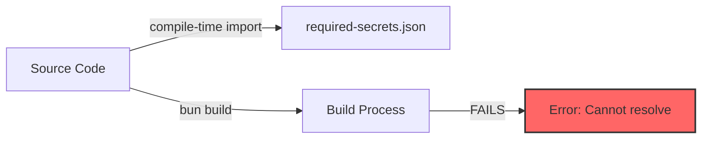
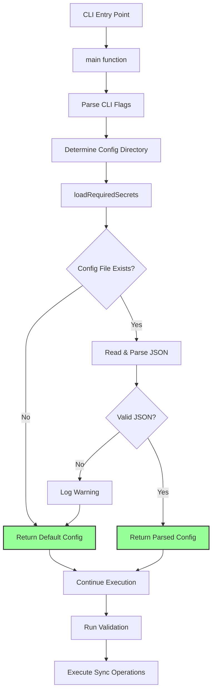
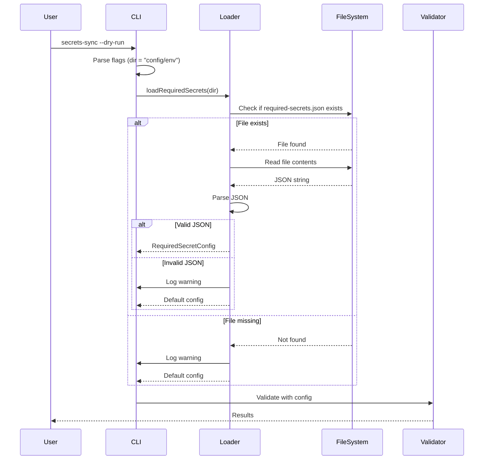
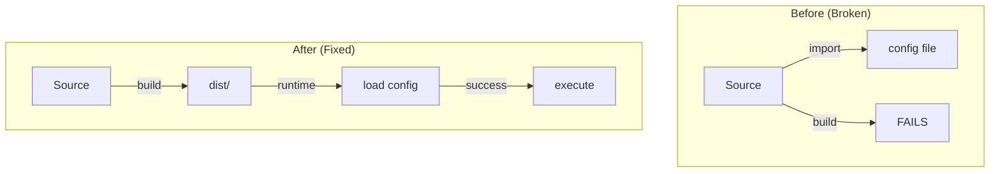
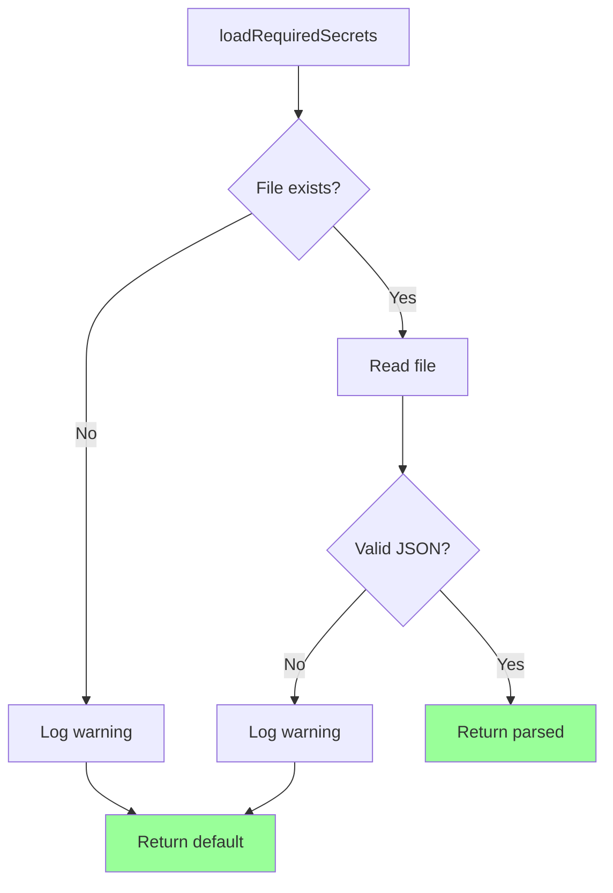

# Design Document: Dynamic Required Secrets Loading

**Issue:** #1  
**Date:** 2025-11-24  
**Requirements:** See requirements.md

---

## Executive Summary

This design replaces compile-time JSON imports with runtime configuration loading, enabling package distribution and flexible configuration. The solution maintains backward compatibility while adding graceful degradation for missing configurations.

**End-User Impact:** Users can install and run the tool immediately without complex setup, optionally adding configuration as their needs grow.

---

## System Architecture Overview

### Current Architecture (Broken)



**Problem:** Build process cannot resolve relative path to config file that doesn't exist in source tree.

---

### Proposed Architecture (Fixed)



**Key Change:** Configuration loading happens at runtime, after build, with graceful fallback.

---

### Data Flow Diagram



---

## Technical Design Details

### Component Design

#### DS-1: Configuration Loader Module

**ID:** DS-1  
**Implements:** FR-1, FR-2, FR-4, FR-5, TR-2  
**Purpose:** Encapsulate all configuration loading logic  
**Location:** Inline in `secrets-sync.ts` (future: extract to `src/config.ts`)

**Interface:**
```typescript
function loadRequiredSecrets(configDir: string): RequiredSecretConfig
```

**Responsibilities:**
- Construct config file path
- Check file existence
- Read file contents
- Parse JSON
- Handle errors gracefully
- Log warnings
- Return default on failure

**End-User Benefit:** Users don't need to understand error handling; tool "just works" with or without config.

---

#### DS-2: Default Configuration Strategy

**ID:** DS-2  
**Implements:** FR-2, US-2  
**Design Decision:** Return empty arrays for all secret categories when config missing

```typescript
const DEFAULT_CONFIG: RequiredSecretConfig = {
  production: [],
  shared: [],
  staging: []
};
```

**Rationale:**
- Empty arrays mean "no validation required"
- Validation logic already handles empty arrays correctly
- No code changes needed in validation logic
- Users can start using tool immediately

**End-User Benefit:** Tool works out-of-the-box; validation is opt-in via config file.

---

#### DS-3: Error Handling Strategy

**ID:** DS-3  
**Implements:** FR-4, FR-5, FR-6, FR-7, NFR-2  
**Design Decision:** Catch all errors, log warnings with [CONFIG] prefix, continue execution

```typescript
try {
  const raw = readFileSync(configPath, 'utf8');
  return JSON.parse(raw) as RequiredSecretConfig;
} catch (e) {
  logWarn(`[CONFIG] Failed to load required-secrets.json: ${(e as Error).message}`);
  return DEFAULT_CONFIG;
}
```

**Error Categories:**
1. **File not found** → Warning with [CONFIG] prefix + default config
2. **Permission denied** → Warning with [CONFIG] prefix + default config  
3. **Invalid JSON** → Warning with [CONFIG] prefix + default config
4. **Unexpected errors** → Warning with [CONFIG] prefix + default config

**End-User Benefit:** Tool never crashes due to config issues; clear warnings guide troubleshooting.

---

#### DS-4: Path Resolution Strategy

**ID:** DS-4  
**Implements:** TR-8, FR-3  
**Design Decision:** Resolve config path relative to user's project root, not package location

```typescript
// configDir comes from CLI flag or default "config/env"
// Resolved relative to process.cwd() (user's project)
const configPath = join(configDir, 'required-secrets.json');
```

**Path Resolution Flow:**
```
User's Project Root (process.cwd())
  └── config/
      └── env/
          └── required-secrets.json  ← Found here
```

**Not:**
```
node_modules/
  └── @dorsey-creative/
      └── secrets-sync/
          └── config/  ← NOT here
```

**End-User Benefit:** Config lives in user's project, under version control, not in node_modules.

---

### Code Changes

#### CC-1: Remove Hardcoded Import (TR-1)

**ID:** CC-1  
**Implements:** TR-1  
**Current (Line 17):**
```typescript
import requiredSecretsRaw from '../config/env/required-secrets.json' assert { type: 'json' };
```

**New:**
```typescript
// REMOVED - config loaded at runtime
```

**Impact:** Build process no longer requires config file to exist.

---

#### CC-2: Add Loader Function (TR-2)

**ID:** CC-2  
**Implements:** TR-2, DS-1, DS-3  
**Location:** After type definitions, before main()

```typescript
/**
 * Load required secrets configuration from user's project
 * @param configDir - Directory containing required-secrets.json
 * @returns Parsed configuration or default empty config
 */
function loadRequiredSecrets(configDir: string): RequiredSecretConfig {
  const configPath = join(configDir, 'required-secrets.json');
  
  // Check if file exists
  if (!existsSync(configPath)) {
    logWarn('[CONFIG] No required-secrets.json found, skipping validation');
    return { production: [], shared: [], staging: [] };
  }
  
  // Attempt to read and parse
  try {
    const raw = readFileSync(configPath, 'utf8');
    const config = JSON.parse(raw) as RequiredSecretConfig;
    logInfo(`[CONFIG] Loaded required secrets from ${configPath}`);
    return config;
  } catch (e) {
    logWarn(`[CONFIG] Failed to load required-secrets.json: ${(e as Error).message}`);
    return { production: [], shared: [], staging: [] };
  }
}
```

**Design Notes:**
- Pure function (no side effects except logging)
- Single responsibility (loading only)
- Defensive (handles all error cases)
- Informative (logs success and failures)

**End-User Benefit:** Clear feedback about config loading status.

---

#### CC-3: Update Initialization (TR-3, TR-4)

**ID:** CC-3  
**Implements:** TR-3, TR-4, DS-4  
**Current (Global scope):**
```typescript
const REQUIRED_SECRETS = requiredSecretsRaw as RequiredSecretConfig;
const REQUIRED_PROD_KEYS: string[] = Array.isArray(REQUIRED_SECRETS.production) 
  ? [...REQUIRED_SECRETS.production] 
  : [];
```

**New (Inside main function, after dir is determined):**
```typescript
async function main() {
  // ... existing flag parsing ...
  const dir = flags.dir ?? DEFAULTS.dir;
  
  // Load configuration at runtime
  const REQUIRED_SECRETS = loadRequiredSecrets(dir);
  const REQUIRED_PROD_KEYS: string[] = Array.isArray(REQUIRED_SECRETS.production) 
    ? [...REQUIRED_SECRETS.production] 
    : [];
  
  // ... rest of main function ...
}
```

**Impact:** Configuration loaded after CLI flags parsed, using user-specified directory.

**End-User Benefit:** Users can customize config location via `--dir` flag.

---

### Configuration File Format

**No changes to format** - maintains backward compatibility.

**Example (config/env/required-secrets.json):**
```json
{
  "shared": [
    "API_KEY",
    "DATABASE_URL"
  ],
  "production": [
    "PROD_SECRET",
    "MAILGUN_API_KEY"
  ],
  "staging": [
    "STAGING_SECRET"
  ]
}
```

**Validation:**
- Must be valid JSON
- Must have `production` array (can be empty)
- `shared` and `staging` are optional
- Array values must be strings

**End-User Benefit:** Existing configs work without modification.

---

## Implementation Approach

### PH-1: Core Implementation (Critical Path)

**ID:** PH-1  
**Implements:** TR-1, TR-2, TR-3, TR-4, TR-6  
**Goal:** Make build work and tool runnable

**Tasks:**
1. Remove hardcoded import statement
2. Implement `loadRequiredSecrets()` function
3. Move `REQUIRED_SECRETS` initialization into `main()`
4. Move `REQUIRED_PROD_KEYS` initialization into `main()`
5. Test build succeeds

**Validation:**
```bash
bun run build
# Should exit with code 0
```

**Success Criteria:**
- ✅ Build completes without errors
- ✅ No import resolution errors
- ✅ dist/secrets-sync.js created

**End-User Impact:** Package can now be built and distributed.

---

### PH-2: Error Handling (Robustness)

**ID:** PH-2  
**Implements:** FR-4, FR-5, FR-6, FR-7, DS-3  
**Goal:** Handle all error cases gracefully

**Tasks:**
1. Add file existence check
2. Add try-catch for file reading
3. Add try-catch for JSON parsing
4. Add warning logs for each error case
5. Return default config on all errors

**Validation:**
```bash
# Test missing file
rm -rf config/
./dist/secrets-sync.js --help
# Should work, show warning

# Test invalid JSON
echo "invalid json" > config/env/required-secrets.json
./dist/secrets-sync.js --help
# Should work, show warning
```

**Success Criteria:**
- ✅ Tool runs with missing config
- ✅ Tool runs with invalid config
- ✅ Warnings logged appropriately
- ✅ No crashes or unhandled exceptions

**End-User Impact:** Tool is resilient; users can't break it with bad config.

---

### PH-3: Testing (Quality Assurance)

**ID:** PH-3  
**Implements:** Test-1 through Test-7, NFR-2, NFR-3  
**Goal:** Comprehensive test coverage

**Tasks:**
1. Write unit tests for `loadRequiredSecrets()`
2. Write integration tests for CLI execution
3. Write build verification tests
4. Test all error paths
5. Test success paths

**Test Structure:**
```
tests/
  ├── unit/
  │   └── config-loader.test.ts
  └── integration/
      └── cli-execution.test.ts
```

**Success Criteria:**
- ✅ All unit tests pass
- ✅ All integration tests pass
- ✅ Code coverage > 80%
- ✅ All acceptance criteria verified

**End-User Impact:** High confidence in reliability; fewer bugs in production.

---

### PH-4: Documentation (Usability)

**ID:** PH-4  
**Implements:** NFR-1, US-1, US-2, US-3  
**Goal:** Clear guidance for users

**Tasks:**
1. Update README with config instructions
2. Add troubleshooting section
3. Document config file format
4. Add examples for common scenarios
5. Update CHANGELOG

**Documentation Sections:**
- Configuration setup
- Optional vs required config
- Config file location
- Validation behavior
- Error messages and solutions

**Success Criteria:**
- ✅ README updated
- ✅ Examples provided
- ✅ Troubleshooting guide added
- ✅ CHANGELOG entry created

**End-User Impact:** Users can self-serve; reduced support burden.

---

## Testing Strategy

### Unit Testing

#### Test Suite 1: loadRequiredSecrets Function

**Test 1.1: Missing Config File**
```typescript
describe('loadRequiredSecrets', () => {
  test('returns default config when file missing', () => {
    const result = loadRequiredSecrets('/nonexistent/path');
    
    expect(result).toEqual({
      production: [],
      shared: [],
      staging: []
    });
  });
});
```

**Validates:** FR-2 (Default Configuration Fallback)

---

**Test 1.2: Valid Config File**
```typescript
test('parses valid config correctly', () => {
  const tempDir = createTempDir();
  writeFileSync(
    join(tempDir, 'required-secrets.json'),
    JSON.stringify({
      production: ['SECRET_1', 'SECRET_2'],
      shared: ['SHARED_1'],
      staging: []
    })
  );
  
  const result = loadRequiredSecrets(tempDir);
  
  expect(result.production).toContain('SECRET_1');
  expect(result.production).toContain('SECRET_2');
  expect(result.shared).toContain('SHARED_1');
});
```

**Validates:** FR-3 (Configuration File Discovery), FR-8 (Type Safety)

---

**Test 1.3: Invalid JSON**
```typescript
test('returns default config for invalid JSON', () => {
  const tempDir = createTempDir();
  writeFileSync(
    join(tempDir, 'required-secrets.json'),
    'invalid json content'
  );
  
  const result = loadRequiredSecrets(tempDir);
  
  expect(result).toEqual({
    production: [],
    shared: [],
    staging: []
  });
});
```

**Validates:** FR-5 (JSON Parsing with Error Recovery)

---

**Test 1.4: Warning Logged for Missing File**
```typescript
test('logs warning when file missing', () => {
  const warnSpy = jest.spyOn(console, 'warn');
  
  loadRequiredSecrets('/nonexistent/path');
  
  expect(warnSpy).toHaveBeenCalledWith(
    expect.stringContaining('No required-secrets.json found')
  );
});
```

**Validates:** FR-6 (Warning Messages for Missing Config)

---

**Test 1.5: Warning Logged for Invalid JSON**
```typescript
test('logs warning when JSON invalid', () => {
  const tempDir = createTempDir();
  writeFileSync(join(tempDir, 'required-secrets.json'), 'bad json');
  const warnSpy = jest.spyOn(console, 'warn');
  
  loadRequiredSecrets(tempDir);
  
  expect(warnSpy).toHaveBeenCalledWith(
    expect.stringContaining('Failed to load required-secrets.json')
  );
});
```

**Validates:** FR-7 (Warning Messages for Invalid Config)

---

### Integration Testing

#### Test Suite 2: Build Process

**Test 2.1: Build Without Config**
```bash
#!/bin/bash
# Clean environment
rm -rf config/ dist/

# Build should succeed
bun run build
EXIT_CODE=$?

# Verify
test $EXIT_CODE -eq 0 || exit 1
test -f dist/secrets-sync.js || exit 1
```

**Validates:** TR-6 (Build Process Independence), AC-6.1, AC-6.2, AC-6.4

---

**Test 2.2: Build Output Executable**
```bash
#!/bin/bash
bun run build

# Check executable bit
test -x dist/secrets-sync.js || exit 1

# Try to run
./dist/secrets-sync.js --version
test $? -eq 0 || exit 1
```

**Validates:** AC-6.3

---

#### Test Suite 3: CLI Execution

**Test 3.1: Help Without Config**
```bash
#!/bin/bash
rm -rf config/

./dist/secrets-sync.js --help > output.txt 2>&1
EXIT_CODE=$?

# Should succeed
test $EXIT_CODE -eq 0 || exit 1

# Should show help text
grep -q "Usage:" output.txt || exit 1
```

**Validates:** AC-2.1, AC-2.2, AC-2.3

---

**Test 3.2: Dry Run Without Config**
```bash
#!/bin/bash
rm -rf config/

./dist/secrets-sync.js --dry-run 2>&1 | tee output.txt
EXIT_CODE=$?

# Should succeed
test $EXIT_CODE -eq 0 || exit 1

# Should show warning
grep -q "No required-secrets.json found" output.txt || exit 1

# Should not crash
! grep -q "Error:" output.txt || exit 1
```

**Validates:** AC-3.1, AC-3.2, AC-3.3, AC-3.4

---

**Test 3.3: Load Valid Config**
```bash
#!/bin/bash
mkdir -p config/env
cat > config/env/required-secrets.json << EOF
{
  "production": ["TEST_SECRET"],
  "shared": [],
  "staging": []
}
EOF

./dist/secrets-sync.js --dry-run 2>&1 | tee output.txt

# Should load config
grep -q "Loaded required secrets" output.txt || exit 1
```

**Validates:** AC-4.1, AC-4.2

---

**Test 3.4: Handle Invalid Config**
```bash
#!/bin/bash
mkdir -p config/env
echo "invalid json" > config/env/required-secrets.json

./dist/secrets-sync.js --dry-run 2>&1 | tee output.txt
EXIT_CODE=$?

# Should not crash
test $EXIT_CODE -eq 0 || exit 1

# Should show warning
grep -q "Failed to load required-secrets.json" output.txt || exit 1
```

**Validates:** AC-5.1, AC-5.2, AC-5.3, AC-5.4

---

#### Test Suite 4: Development Mode

**Test 4.1: Dev Mode Without Config**
```bash
#!/bin/bash
rm -rf config/

bun run dev -- --help > output.txt 2>&1
EXIT_CODE=$?

test $EXIT_CODE -eq 0 || exit 1
grep -q "Usage:" output.txt || exit 1
```

**Validates:** AC-7.1, AC-7.2, AC-7.3

---

### Performance Testing

**Test 5.1: Startup Time Impact**
```typescript
test('config loading adds < 10ms to startup', async () => {
  const start = performance.now();
  loadRequiredSecrets('config/env');
  const duration = performance.now() - start;
  
  expect(duration).toBeLessThan(10);
});
```

**Validates:** NFR-1 (Performance)

---

### Manual Testing Checklist

- [ ] Install package via npm in clean environment
- [ ] Run CLI without config directory
- [ ] Create config file and verify loading
- [ ] Test with invalid JSON
- [ ] Test with missing permissions
- [ ] Verify warning messages are clear
- [ ] Test on macOS, Linux, Windows
- [ ] Test with different Node versions (18+)

---

## Design Decisions & Rationale

### Decision 1: Runtime Loading vs Bundling

**Options Considered:**
1. Bundle default config into compiled output
2. Load config at runtime
3. Require config as CLI parameter

**Chosen:** Runtime loading (Option 2)

**Rationale:**
- Allows users to customize without rebuilding
- Config stays in user's project (version control)
- Enables graceful degradation
- Standard pattern for CLI tools

**End-User Benefit:** Flexibility without complexity.

---

### Decision 2: Default Empty Config vs Error

**Options Considered:**
1. Throw error when config missing
2. Return empty default config
3. Prompt user to create config

**Chosen:** Empty default config (Option 2)

**Rationale:**
- Tool works immediately after install
- Validation becomes opt-in feature
- No breaking changes for simple use cases
- Follows principle of least surprise

**End-User Benefit:** Zero-config startup; add validation when needed.

---

### Decision 3: Warning vs Silent Fallback

**Options Considered:**
1. Silently use defaults
2. Log warning message
3. Require explicit acknowledgment

**Chosen:** Log warning (Option 2)

**Rationale:**
- Users aware of missing config
- Can troubleshoot if unexpected
- Not intrusive (just a warning)
- Helps with debugging

**End-User Benefit:** Transparency without friction.

---

### Decision 4: Single Function vs Module

**Driven by:** TR-2 (implementation requirement), NFR-4 (maintainability)

**Options Considered:**
1. Inline code in main()
2. Single utility function
3. Separate config module

**Chosen:** Single utility function (Option 2)

**Rationale:**
- Keeps change minimal
- Easy to test in isolation
- Can extract to module later
- Follows existing code style

**End-User Benefit:** Faster delivery; less risk of bugs.

---

## API Design

### Public API: loadRequiredSecrets

```typescript
/**
 * Load required secrets configuration from user's project
 * 
 * @param configDir - Directory containing required-secrets.json
 *                    Resolved relative to process.cwd()
 * @returns Parsed configuration or default empty config
 * 
 * @example
 * // Load from default location
 * const config = loadRequiredSecrets('config/env');
 * 
 * @example
 * // Load from custom location
 * const config = loadRequiredSecrets('/path/to/config');
 * 
 * @example
 * // Handle missing config
 * const config = loadRequiredSecrets('nonexistent');
 * // Returns: { production: [], shared: [], staging: [] }
 */
function loadRequiredSecrets(configDir: string): RequiredSecretConfig
```

**Developer Validation:**
```typescript
// Test 1: Function exists and is callable
const result = loadRequiredSecrets('config/env');
expect(typeof result).toBe('object');

// Test 2: Returns correct type
expect(result).toHaveProperty('production');
expect(Array.isArray(result.production)).toBe(true);

// Test 3: Handles missing config
const defaultResult = loadRequiredSecrets('/nonexistent');
expect(defaultResult.production).toEqual([]);
```

---

## Migration Path

### For Existing Users

**No action required** - config file format unchanged.

**If experiencing issues:**
1. Verify config file location: `config/env/required-secrets.json`
2. Validate JSON syntax
3. Check file permissions
4. Review warning messages

---

### For New Users

**Quick Start (No Config):**
```bash
npm install @dorsey-creative/secrets-sync
secrets-sync --help
secrets-sync --dry-run
```

**With Validation:**
```bash
mkdir -p config/env
cat > config/env/required-secrets.json << EOF
{
  "production": ["API_KEY", "DATABASE_URL"],
  "shared": [],
  "staging": []
}
EOF

secrets-sync --dry-run
```

---

## Rollback Plan

**If critical issues discovered:**

1. Revert commit
2. Re-add hardcoded import temporarily
3. Bundle example config in package
4. Release hotfix version
5. Investigate and fix properly

**Rollback Risk:** Low - changes are isolated and well-tested.

---

## Success Metrics

### Technical Metrics
- [ ] Build success rate: 100% (TR-6, AC-6.1-6.4)
- [ ] Test coverage: > 80% (Test-1 through Test-7)
- [ ] All acceptance criteria: PASS (AC-1.1 through AC-7.3)
- [ ] All functional requirements validated (FR-1 through FR-8)
- [ ] All technical requirements implemented (TR-1 through TR-8)

### User Metrics
- [ ] Installation success rate: 100% (US-1, AC-1.1-1.3)
- [ ] Zero config-related crashes (FR-4, DS-3)
- [ ] Clear error messages (NFR-1, NFR-2, manual review)
- [ ] Documentation completeness (PH-4, manual review)

---

## Future Enhancements

**Out of scope for this issue, but enabled by this design:**

1. **Multiple config sources** - env vars, CLI flags
2. **Config validation** - JSON schema validation
3. **Config generation** - Interactive setup wizard
4. **Config merging** - Combine multiple config files
5. **Remote configs** - Load from URLs or git repos

**This design enables these features** by establishing the runtime loading pattern.

---

## Appendix: Mermaid Diagram Source

### Architecture Comparison


### Error Handling Flow


---

## Implementation Timeline

**Estimated Effort:** 4-6 hours

- Phase 1 (Core): 1-2 hours
- Phase 2 (Error Handling): 1 hour
- Phase 3 (Testing): 2-3 hours
- Phase 4 (Documentation): 1 hour

**Dependencies:** None - can start immediately

**Blockers:** None identified

---

## Sign-off Checklist

- [ ] Design reviewed by team
- [ ] All requirements addressed
- [ ] Test strategy approved
- [ ] Documentation plan approved
- [ ] Ready for implementation
