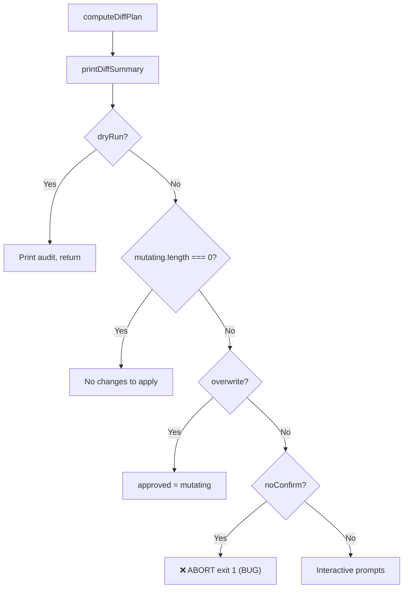
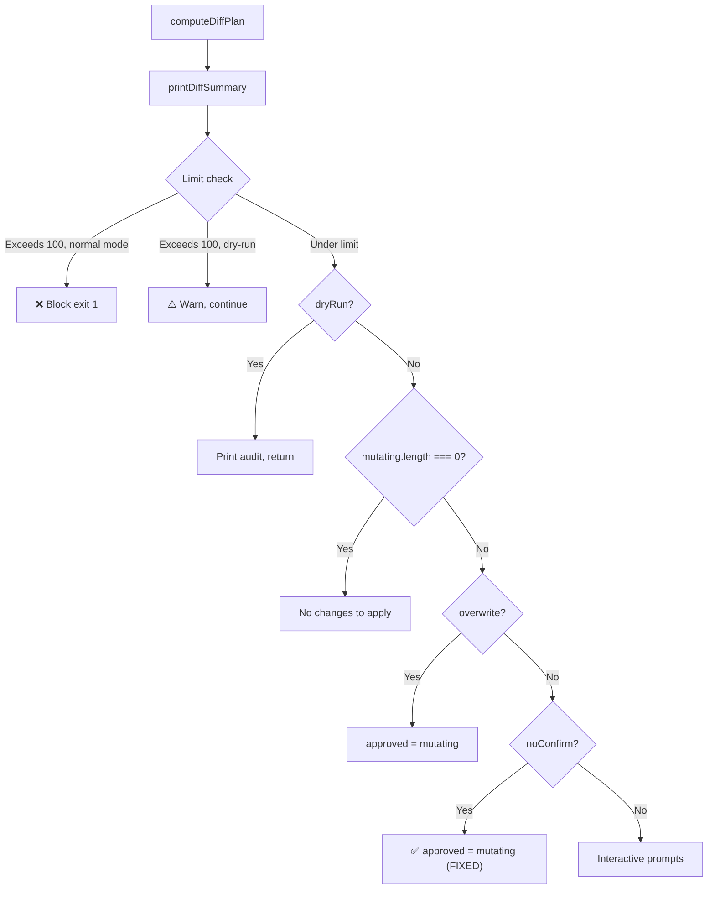

# Design: --no-confirm Flag Fix & GitHub Secrets Limit Pre-flight Check

## Overview

Two surgical changes to `src/secrets-sync.ts`:
1. Replace the `--no-confirm` abort logic with approval logic (3 lines changed).
2. Insert a secrets limit check between plan computation and the confirmation workflow (~15 lines added).

No new files, no new dependencies, no architectural changes.

---

## System Architecture

### Current Confirmation Flow (Buggy)



### Fixed Confirmation Flow



---

## Technical Design

### Fix A: --no-confirm Implies Consent

**Location:** `src/secrets-sync.ts`, lines 1635–1638

**Current code:**
```typescript
} else if (flags.noConfirm) {
  console.error('--no-confirm supplied without --overwrite; refusing to prompt. Aborting with no changes.');
  process.exitCode = 1;
  return;
}
```

**Replacement:**
```typescript
} else if (flags.noConfirm) {
  approved = mutating; // --no-confirm implies consent for all planned changes
  console.log('--no-confirm supplied: approving all planned changes without prompts.');
}
```

**Key design decisions:**

1. **`approved = mutating`** — assigns the full set of mutating changes, identical to what `--overwrite` does for the confirmation bypass. This is equivalent to a user typing "a" (all) at the interactive prompt.

2. **No `forceOverwrite` activation** — the `computeDiffPlan()` call at line ~1593 passes `flags.overwrite ?? false` as the `forceOverwrite` parameter. Since `--no-confirm` does not set `flags.overwrite`, the diff plan remains based on actual change detection. Only truly changed secrets appear as `update` actions.

3. **`console.log` instead of `console.error`** — this is a success path, not an error. The message goes to stdout (like `--overwrite`'s message at line 1634).

4. **No change to `--overwrite` branch** — the `if/else if` chain processes `overwrite` first (line 1632), so when both flags are present, `--overwrite` takes precedence. This preserves existing `--overwrite --no-confirm` behavior.

---

### Fix B: Secrets Limit Pre-flight Check

**Location:** `src/secrets-sync.ts`, inserted between `printDiffSummary(plan)` (line ~1617) and the `// Confirmation workflow` comment (line ~1619). The limit check MUST come BEFORE the `if (flags.dryRun)` branch at line ~1621. This is critical: the dry-run early return is the FIRST branch inside the confirmation section, so inserting the limit check after it would prevent the dry-run warning (REQ-010) from ever firing.

**Exact insertion point:**
```
printDiffSummary(plan);          // ← existing line ~1617
                                  // ← INSERT LIMIT CHECK HERE
// Confirmation workflow           // ← existing line ~1619
const mutating = plan.filter(...); // ← existing line ~1620
if (flags.dryRun) { ... }         // ← existing line ~1621
```

**New code block:**

```typescript
// REQ-008: Secrets limit pre-flight check (runs in all modes including mock — data-driven)
const creates = plan.filter(p => p.action === 'create').length;
const deletes = plan.filter(p => p.action === 'delete').length;
const projectedTotal = existing.size + creates - deletes;  // REQ-012: Net-change formula
const REPO_SECRET_LIMIT = 100;

if (projectedTotal > REPO_SECRET_LIMIT) {
  if (existing.size === 0 && creates > 0) {
    // REQ-013: adapter.list() may have failed — cannot trust count
    console.warn(`⚠️  Cannot verify secrets limit (existing count is 0 — gh secret list may have failed).`);
  } else if (flags.dryRun) {
    // REQ-010: Warn in dry-run mode but don't block
    console.warn(`⚠️  Plan would exceed GitHub repository secrets limit (${REPO_SECRET_LIMIT}).`);
    console.warn(`   Current: ${existing.size}, Creating: +${creates}, Deleting: -${deletes}, Projected: ${projectedTotal}`);
  } else {
    // REQ-009: Hard block in normal mode
    console.error(`❌ Would exceed GitHub repository secrets limit (${REPO_SECRET_LIMIT}).`);
    console.error(`   Current: ${existing.size}, Creating: +${creates}, Deleting: -${deletes}, Projected: ${projectedTotal}`);
    console.error(`   Reduce the number of secrets or remove unused ones before syncing.`);
    process.exitCode = 1;
    return;
  }
}
```

**Key design decisions:**

1. **Placement before the `if (flags.dryRun)` branch** — the check runs after `computeDiffPlan()` and `printDiffSummary()` return (so we have `creates` and `deletes` counts) and BEFORE the dry-run early return or any interactive prompts. This ensures: (a) in dry-run mode, the limit warning prints before the dry-run audit summary; (b) in normal mode, the hard block prevents reaching the confirmation workflow.

2. **No `!MOCK_MODE` guard** — the limit check is purely data-driven. It operates on `existing.size` (populated by whichever adapter is active — real or mock) and `plan` counts. In mock mode with small `.secrets-mock.json` datasets (<100 entries), the check naturally passes without interference. In mock mode with large datasets (98+ entries for testing), the check correctly fires. This eliminates the testability contradiction where tests needed the mock adapter but the guard prevented the check from running. Tests control behavior through data size, not mode flags.

3. **Net-change formula: `existing.size + creates - deletes`** — only net-new secrets count. If the plan deletes 5 secrets and creates 8, the net increase is 3. This correctly handles scenarios where creates are offset by deletes.

4. **Graceful handling of unknown existing count** — if `adapter.list()` failed (returned empty Map), `existing.size === 0`. If the plan has creates, the projected total would be `0 + creates - deletes`. This could be very wrong (the real count might be 95, not 0). So when `existing.size === 0 && creates > 0`, we warn but don't block — the user might legitimately be starting fresh, or the API call might have failed. The warning alerts the user without creating a false positive block.

5. **Dry-run shows warning, not error** — in dry-run mode, users are reviewing the plan. Showing the limit warning helps them plan ahead. But dry-run should not exit nonzero for this (it's informational, like other dry-run output).

6. **Error message format** — includes all relevant numbers (current, creates, deletes, projected) per REQ-014. Uses `❌` prefix consistent with existing error patterns (e.g., token scope check).

---

## Implementation Approach

### Phase 1: Both Fixes + Tests

Since both changes are small and independent, they can be implemented together:

1. Fix the `--no-confirm` abort condition (3 lines).
2. Add the secrets limit check (~15 lines).
3. Write integration tests for both.

### No Phase 2 Needed

These are surgical fixes. No refactoring, no new modules, no new dependencies.

---

## Testing Strategy

### Integration Tests (`tests/integration/no-confirm-and-secrets-limit.test.ts`)

All tests use `SECRETS_SYNC_MOCK=1` and `SKIP_DEPENDENCY_CHECK=1` to avoid real GitHub interactions. The limit check runs in mock mode (no guard) — tests control whether the check fires through mock data size.

#### --no-confirm Tests

```typescript
describe('--no-confirm flag', () => {
  test('approves all planned changes without prompting (REQ-001, REQ-003)');
  test('does not force-update unchanged secrets (REQ-002)');
  test('outputs auto-approval message (REQ-007)');
  test('--overwrite still forces all updates (REQ-004)');
  test('--overwrite --no-confirm behaves like --overwrite alone (REQ-005)');
});
```

**Test setup for REQ-001/REQ-003:**
- Create a `.env` with new keys not in `.secrets-mock.json`
- Run with `--no-confirm` (no `--dry-run`)
- Assert exit code 0 and stdout contains "approving all planned changes"
- Assert `.secrets-mock.json` is updated (mock adapter persists)

**Test setup for REQ-002:**
- Create a `.env` with keys that already exist in `.secrets-mock.json` with same values
- Run with `--no-confirm`
- Assert plan shows `noop` (not `update`) for unchanged secrets
- Compare to `--overwrite` which shows `update` for all

#### Secrets Limit Tests

```typescript
describe('secrets limit check', () => {
  test('blocks when projected total exceeds 100 (REQ-008, REQ-009)');
  test('shows warning in dry-run mode (REQ-010)');
  test('accounts for deletes offsetting creates (REQ-012)');
  test('warns but proceeds when existing count is 0 (REQ-013)');
  test('error message shows all counts (REQ-014)');
  test('does not fire when projected ≤ 100');
});
```

**Test setup for REQ-008/REQ-009:**
- Create `.secrets-mock.json` with 98 entries (programmatically generated)
- Create `.env` with 5 new keys (projected: 98 + 5 = 103)
- Run with `SECRETS_SYNC_MOCK=1` and `--no-confirm`
- Assert exit code 1 and stderr contains limit error

**Why no `!MOCK_MODE` guard:** The limit check is purely data-driven. It operates on `existing.size` from whichever adapter is active. In mock mode, `existing.size` comes from `.secrets-mock.json`. Tests that want to trigger the limit use 98+ entries. Tests that don't want limit interference use <100 entries. No special env vars or guard-removal needed.

---

## Requirement-to-Design Mapping

| Requirement | Design Section |
|-------------|---------------|
| REQ-001 | Fix A: `approved = mutating` |
| REQ-002 | Fix A: No `forceOverwrite` activation |
| REQ-003 | Fix A: Replace abort with approval |
| REQ-004 | Fix A: `--overwrite` branch unchanged |
| REQ-005 | Fix A: `if/else if` chain, overwrite checked first |
| REQ-006 | Fix A: `else` interactive branch unchanged |
| REQ-007 | Fix A: `console.log` message |
| REQ-008 | Fix B: Placement before confirmation workflow |
| REQ-009 | Fix B: Hard block with exit 1 |
| REQ-010 | Fix B: `flags.dryRun` branch with `console.warn` |
| REQ-011 | Fix B: Data-driven (no mock guard — small mock data naturally passes) |
| REQ-012 | Fix B: `existing.size + creates - deletes` formula |
| REQ-013 | Fix B: `existing.size === 0 && creates > 0` heuristic |
| REQ-014 | Fix B: Error message format with all counts |
| REQ-015 | Both fixes: No imports, no package.json changes |
| REQ-016 | Testing Strategy section |
| REQ-017 | Both fixes: minimal surgical changes |

---

## Security Considerations

- No secret values are exposed in limit error messages (only counts).
- The `--no-confirm` fix does not change what data is sent to GitHub — only whether prompts are shown.
- No new subprocess calls or network requests are added.

---

## Performance Considerations

- The limit check adds `plan.filter()` calls (two passes over the plan array). For typical plans (<1000 entries), this is negligible (<1ms).
- No additional API calls — uses data already fetched by `adapter.list()`.
