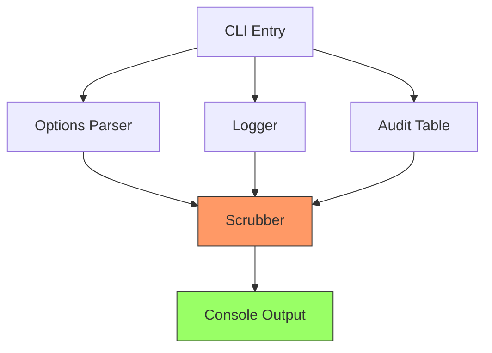
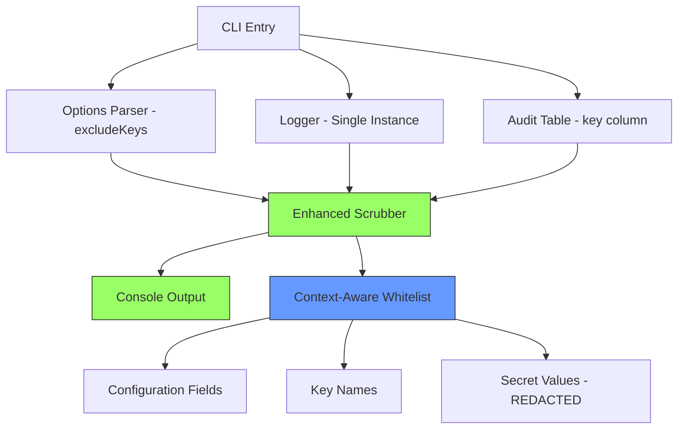

# Design: Scrubber Over-Redaction Fixes

## Executive Summary

Fix scrubber over-redaction by enhancing whitelist logic and eliminating duplicate logging. This is a patch release with no breaking changes or API modifications.

**Version:** 1.1.1 (patch release)  
**Breaking Changes:** None

**User Impact:**
- Users can see their configuration in options table
- Users can see which secrets are being synced in audit table
- Clean, readable log output
- Developers can test locally without committing secrets

## System Architecture Overview

### Current Architecture



**Problem:** Scrubber intercepts all output and over-redacts configuration fields and key names.

### Proposed Architecture



**Solution:** Enhanced whitelist distinguishes between configuration fields, key names, and secret values.

## Design Decisions

### Decision 1: Whitelist-Only Approach

**Decision:** Add field names to whitelist instead of renaming fields

**Rationale:**
- No breaking changes required
- Simpler implementation
- Maintains backward compatibility
- Users don't need to update configurations

**User Success:**
- Existing configurations continue to work
- No migration needed
- Immediate fix with patch release

**Implementation:**
```typescript
const WHITELISTED_KEYS = new Set([
  // ... existing entries
  'skipsecrets',  // Configuration field
  'secret',       // Audit table column
  'key', 'name', 'source', 'action', 'status', // Audit columns
]);
```

**No Breaking Changes:** Patch release (1.1.1)

### Decision 2: Logger Deduplication

**Decision:** Investigate and fix duplicate log source

**Rationale:**
- Likely caused by multiple logger instances or duplicate event listeners
- Need to trace log flow to identify root cause
- May be related to scrubber bootstrap interception

**User Success:**
- Clean, readable output
- No confusion from duplicate messages
- Professional CLI experience

**Investigation Approach:**
1. Check for multiple logger instances
2. Check for console.log bypassing logger
3. Check scrubber bootstrap for duplicate interception
4. Add debug flag to trace log calls

### Decision 3: Example Directory Structure

**Decision:** Create `example/` directory with git and npm ignore

**Rationale:**
- Developers need safe testing environment
- Should not be committed or distributed
- Mirrors production structure for realistic testing

**User Success:**
- Developers catch bugs before production
- Safe to use real-like test data
- No risk of committing secrets

**Structure:**
```
example/
├── config/
│   └── env/
│       ├── .env
│       ├── .env.staging
│       └── .env.development
└── README.md
```

## Technical Design

### Component 1: Scrubber Whitelist Enhancement

**File:** `src/utils/scrubber.ts`

**Changes:**
```typescript
// Enhanced whitelist with configuration and audit fields
const WHITELISTED_KEYS = new Set([
  // Existing entries
  'debug', 'node_env', 'port',
  'host', 'hostname', 'path',
  'log_level', 'verbose',
  'secrets_sync_timeout',
  
  // NEW: Configuration fields
  'skipsecrets',
  
  // NEW: Audit table internal field (abstracted from display)
  'secretkey',  // Internal field name (displayed as "Secret Name")
  
  // NEW: Other audit columns
  'key', 'name', 'source', 'action', 'status',
  
  // NEW: Options table fields
  'env', 'dir', 'dryrun', 'overwrite', 'force', 'noconfirm',
  'fixgitignore', 'skipgitignorecheck',
]);
```

**Audit Table Abstraction:**
```typescript
// Internal field name (whitelisted)
interface AuditEntry {
  secretKey: string;  // Internal: whitelisted
  source: string;
  action: string;
  status: string;
}

// Display mapping (shown to user)
console.table(auditEntries.map(entry => ({
  'Secret Name': entry.secretKey,  // Display name
  'Source': entry.source,
  'Action': entry.action,
  'Status': entry.status,
})));
```

**Validation:**
- Unit test: `isSecretKey('skipsecrets')` returns false
- Unit test: `isSecretKey('secretkey')` returns false (internal field)
- Integration test: Options table shows skipSecrets value
- Integration test: Audit table shows key names with "Secret Name" header

### Component 2: Logger Deduplication

**File:** `src/utils/logger.ts` and `src/bootstrap.ts`

**Investigation Steps:**

1. **Check Logger Instances:**
```typescript
// Add singleton pattern if missing
let loggerInstance: Logger | null = null;

export function getLogger(): Logger {
  if (!loggerInstance) {
    loggerInstance = new Logger();
  }
  return loggerInstance;
}
```

2. **Check Bootstrap Interception:**
```typescript
// In bootstrap.ts - ensure single interception
if (!console._scrubberPatched) {
  const originalLog = console.log;
  console.log = (...args) => {
    originalLog(...args.map(arg => 
      typeof arg === 'string' ? scrubSecrets(arg) : scrubObject(arg)
    ));
  };
  console._scrubberPatched = true;
}
```

3. **Check Logger Calls:**
```typescript
// Ensure logger doesn't call console.log AND emit event
class Logger {
  log(level: string, message: string) {
    const formatted = this.format(level, message);
    // Only output once - choose one:
    console.log(formatted); // OR
    this.emit('log', formatted); // NOT BOTH
  }
}
```

**Validation:**
- Unit test: Logger outputs message exactly once
- Integration test: No duplicate entries in CLI output
- E2E test: Full CLI run shows clean output

### Component 3: Example Directory Setup

**Files:** `.gitignore`, `.npmignore`, `example/README.md`

**Changes:**

1. **Update .gitignore:**
```gitignore
# Existing entries
node_modules/
dist/
*.log

# NEW: Example directory
example/
```

2. **Update .npmignore or package.json:**
```json
{
  "files": [
    "dist",
    "README.md",
    "CHANGELOG.md",
    "LICENSE"
  ]
}
```
Note: `example/` automatically excluded by files whitelist

3. **Create example/README.md:**
```markdown
# Example Test Environment

This directory is for local testing only and is excluded from git and npm.

## Setup

1. Copy your test .env files here:
   ```
   example/config/env/.env
   example/config/env/.env.staging
   ```

2. Run CLI against example directory:
   ```
   bun run dev -- --dir example/config/env --dry-run
   ```

## Safety

- Never commit this directory
- Use fake/test secrets only
- Scrubber will still redact output
```

**Validation:**
- Manual test: Create example/ files, verify not in git status
- Manual test: Run `npm pack`, verify example/ not in tarball
- Documentation test: Follow example/README.md instructions

### Component 4: Pre-commit Hook

**File:** `.husky/pre-commit` or `.git/hooks/pre-commit`

**Changes:**
```bash
#!/bin/sh
# Pre-commit hook to prevent example/ directory commits

# Check if example/ files are staged
if git diff --cached --name-only | grep -q "^example/"; then
  echo "❌ Error: Cannot commit files in example/ directory"
  echo ""
  echo "The example/ directory is for local testing only and should never be committed."
  echo ""
  echo "Staged example/ files:"
  git diff --cached --name-only | grep "^example/"
  echo ""
  echo "To unstage: git reset HEAD example/"
  exit 1
fi

exit 0
```

**Validation:**
- Test: Stage example/ file and attempt commit (should fail)
- Test: Commit without example/ files (should succeed)
- Integration test: Verify hook prevents example/ commits

### Component 5: Performance Testing

**File:** `tests/performance/scrubber-performance.test.ts`

**Changes:**
```typescript
describe('Scrubber Performance', () => {
  it('isSecretKey should execute in < 1ms', () => {
    const start = performance.now();
    for (let i = 0; i < 1000; i++) {
      isSecretKey('skipsecrets');
      isSecretKey('secretkey');
      isSecretKey('API_KEY');
    }
    const end = performance.now();
    const avgTime = (end - start) / 1000;
    expect(avgTime).toBeLessThan(1);
  });
  
  it('CLI startup should be < 500ms', async () => {
    const start = performance.now();
    await runCLI(['--version']);
    const end = performance.now();
    expect(end - start).toBeLessThan(500);
  });
});
```

**Validation:**
- Benchmark: isSecretKey() < 1ms per call
- Benchmark: CLI startup < 500ms
- Report: Generate coverage report with `bun test --coverage`

## Implementation Phases

### Phase 1: Whitelist Enhancement (Low Risk)
**Goal:** Fix immediate redaction issues

**Tasks:**
1. Add configuration and audit fields to WHITELISTED_KEYS
2. Abstract audit table internal field name from display
3. Add unit tests for whitelist matching
4. Run integration tests to verify options table
5. Run integration tests to verify audit table

**Validation:**
- All existing tests pass
- Options table shows configuration values
- Audit table shows key names with "Secret Name" header

**Estimated Effort:** 2.5 hours

### Phase 2: Logger Deduplication (Medium Risk - MANDATORY)
**Goal:** Eliminate duplicate log entries

**Tasks:**
1. Add debug logging to trace log calls
2. Identify source of duplicates (logger instance, bootstrap, event listeners)
3. Implement fix (singleton, remove duplicate calls, etc.)
4. Add integration test for single log output
5. Verify all log messages appear exactly once
6. Ensure timestamps only in structured logger (not console output)

**Validation:**
- No duplicate log entries in any CLI output
- All existing tests pass
- New test verifies single output per log call
- Timestamps stored for debugging only

**Estimated Effort:** 4 hours

### Phase 3: Example Directory & Pre-commit Hook (Low Risk)
**Goal:** Create local testing environment with safety measures

**Tasks:**
1. Create example/ directory structure
2. Add example/ to .gitignore
3. Verify package.json files field excludes example/
4. Create example/README.md with usage instructions
5. Create pre-commit hook to prevent example/ commits
6. Update CONTRIBUTING.md with example/ testing workflow
7. Test npm pack to verify exclusion

**Validation:**
- example/ not in git status
- example/ not in npm tarball
- Can run CLI against example/ files
- Pre-commit hook prevents example/ commits

**Estimated Effort:** 2.5 hours

### Phase 4: Performance Testing & Documentation (Low Risk)
**Goal:** Validate performance and create testing documentation

**Tasks:**
1. Create performance benchmarks for isSecretKey()
2. Measure CLI startup time
3. Generate test coverage report
4. Create TESTING.md with manual testing checklist
5. Create rollback plan document
6. Create release checklist

**Validation:**
- Performance benchmarks pass (< 1ms)
- Coverage report shows 80%+
- TESTING.md complete
- Rollback plan documented

**Estimated Effort:** 2 hours

### Phase 5: Release (Low Risk)
**Goal:** Release fixes as v1.1.1

**Tasks:**
1. Update version to 1.1.1 in package.json
2. Update CHANGELOG with all changes (high-level only, no implementation details)
3. Run full test suite (254+ tests)
4. Follow release checklist
5. Create release PR
6. Publish to npm

**Validation:**
- All 254+ tests pass
- CHANGELOG documents fixes (no security details)
- No breaking changes

**Estimated Effort:** 1 hour

**Total Estimated Effort:** 12 hours

## Testing Strategy

### Unit Tests

**Scrubber Whitelist:**
```typescript
describe('isSecretKey with enhanced whitelist', () => {
  it('should not redact excludeKeys', () => {
    expect(isSecretKey('excludeKeys')).toBe(false);
  });
  
  it('should not redact key column', () => {
    expect(isSecretKey('key')).toBe(false);
  });
  
  it('should not redact audit columns', () => {
    expect(isSecretKey('source')).toBe(false);
    expect(isSecretKey('action')).toBe(false);
    expect(isSecretKey('status')).toBe(false);
  });
  
  it('should still redact actual secrets', () => {
    expect(isSecretKey('API_KEY')).toBe(true);
    expect(isSecretKey('password')).toBe(true);
  });
});
```

**Logger Singleton:**
```typescript
describe('Logger singleton', () => {
  it('should return same instance', () => {
    const logger1 = getLogger();
    const logger2 = getLogger();
    expect(logger1).toBe(logger2);
  });
  
  it('should output message exactly once', () => {
    const spy = jest.spyOn(console, 'log');
    logger.info('test message');
    expect(spy).toHaveBeenCalledTimes(1);
  });
});
```

**Configuration Loader:**
```typescript
describe('Config loader with excludeKeys', () => {
  it('should load excludeKeys from YAML', () => {
    const config = loadConfig('test-config.yml');
    expect(config.excludeKeys).toEqual(['DEBUG', 'LOCAL']);
  });
  
  it('should show deprecation for skipSecrets', () => {
    const warnSpy = jest.spyOn(logger, 'warn');
    loadConfig('old-config.yml'); // has skipSecrets
    expect(warnSpy).toHaveBeenCalledWith(
      expect.stringContaining('skipSecrets is deprecated')
    );
  });
});
```

### Integration Tests

**Options Table Output:**
```typescript
describe('CLI options table', () => {
  it('should show excludeKeys value', async () => {
    const output = await runCLI(['--exclude-keys', 'DEBUG,LOCAL', '--dry-run']);
    expect(output).toContain('excludeKeys');
    expect(output).toContain('DEBUG,LOCAL');
    expect(output).not.toContain('[REDACTED]');
  });
});
```

**Audit Table Output:**
```typescript
describe('Audit table', () => {
  it('should show key names', async () => {
    const output = await runCLI(['--dry-run']);
    expect(output).toContain('GITHUB_PROFILE');
    expect(output).toContain('API_KEY');
    expect(output).not.toContain('[REDACTED]'); // in key column
  });
  
  it('should have key column header', async () => {
    const output = await runCLI(['--dry-run']);
    expect(output).toMatch(/│\s+key\s+│/);
  });
});
```

**Logger Deduplication:**
```typescript
describe('Logger output', () => {
  it('should not duplicate log entries', async () => {
    const output = await runCLI(['--dry-run']);
    const lines = output.split('\n');
    const warningLines = lines.filter(l => 
      l.includes('[WARN] [CONFIG] No required-secrets.json')
    );
    expect(warningLines).toHaveLength(1);
  });
});
```

### E2E Tests

**Full CLI Run:**
```typescript
describe('E2E: Scrubber fixes', () => {
  it('should show clean output with visible config', async () => {
    const output = await runCLI([
      '--exclude-keys', 'DEBUG',
      '--dry-run',
      '--verbose'
    ]);
    
    // Check options table
    expect(output).toContain('excludeKeys');
    expect(output).toContain('DEBUG');
    
    // Check audit table
    expect(output).toMatch(/│\s+key\s+│/);
    expect(output).toContain('GITHUB_PROFILE');
    
    // Check no duplicates
    const lines = output.split('\n');
    const uniqueLines = new Set(lines);
    expect(lines.length).toBe(uniqueLines.size);
  });
});
```

**Example Directory:**
```typescript
describe('E2E: Example directory', () => {
  it('should run against example files', async () => {
    // Setup example files
    await setupExampleEnv();
    
    const output = await runCLI([
      '--dir', 'example/config/env',
      '--dry-run'
    ]);
    
    expect(output).toContain('Discovered env files');
    expect(output).not.toContain('Error');
  });
  
  it('should not include example in git', async () => {
    const gitStatus = await exec('git status --porcelain');
    expect(gitStatus).not.toContain('example/');
  });
});
```

### Manual Testing Checklist

- [ ] Run CLI with --exclude-keys flag
- [ ] Verify options table shows excludeKeys value
- [ ] Verify audit table shows key names
- [ ] Verify no duplicate log entries
- [ ] Create example/ directory with test files
- [ ] Run CLI against example/ directory
- [ ] Verify example/ not in git status
- [ ] Run npm pack and inspect tarball
- [ ] Verify example/ not in package
- [ ] Test with old skipSecrets config (deprecation warning)
- [ ] Test with new excludeKeys config (no warning)

## Risks and Mitigations

### Risk 1: Whitelist Too Broad
**Risk:** Adding "secret" to whitelist might allow leaks  
**Severity:** Low  
**Mitigation:**
- "secret" only matches exact field name, not substrings in values
- Still checks isWhitelisted() before allowing
- Comprehensive test coverage for edge cases
- Security audit tests still pass

### Risk 2: Logger Fix Complexity
**Risk:** Root cause of duplicates may be hard to find  
**Severity:** Low  
**Mitigation:**
- Add debug logging to trace calls
- Systematic investigation approach
- Can defer to separate issue if needed
- Not blocking other fixes

### Risk 3: Example Directory Committed
**Risk:** Developer accidentally commits example/ with secrets  
**Severity:** Medium  
**Mitigation:**
- .gitignore prevents commit
- Pre-commit hook checks for example/
- Documentation emphasizes "never commit"
- Use fake/test secrets only

## Success Metrics

### User Experience
- [ ] Options table shows configuration values (not [REDACTED])
- [ ] Audit table shows key names (not [REDACTED])
- [ ] No duplicate log entries in any output
- [ ] Clean, professional CLI output

### Developer Experience
- [ ] Can test locally with example/ directory
- [ ] Example/ never committed or distributed
- [ ] Clear migration guide for breaking changes
- [ ] All tests pass (254+)

### Security
- [ ] Secret values still redacted
- [ ] Security audit tests still pass
- [ ] No new attack vectors introduced
- [ ] Whitelist changes documented

## Future Enhancements

1. **User-Configurable Whitelist:** Allow users to add custom whitelisted fields
2. **Context-Aware Scrubbing:** Different rules for different output contexts
3. **Log Retention:** Configurable log history and rotation
4. **Structured Logging:** JSON output mode for machine parsing

## References

- Problem Statement: `development/scrubber-fixes/problem-statement.md`
- Requirements: `development/scrubber-fixes/requirements.md`
- Existing Scrubber: `src/utils/scrubber.ts`
- Existing Logger: `src/utils/logger.ts`
- CLI Entry: `src/secrets-sync.ts`
